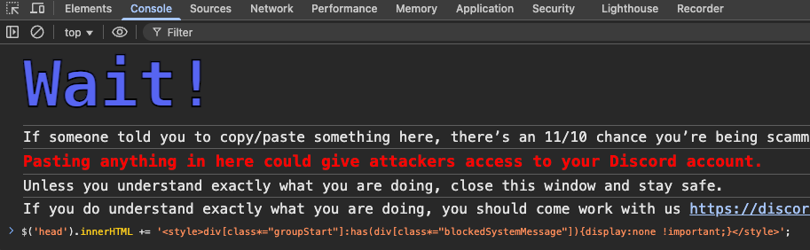

# Discord 完全隱藏封鎖/忽略的訊息

## 前言

Discord 提供了兩種「照顧心理衛生」的方式來處理不想看到的訊息：**封鎖（Block）**和**忽略（Ignore）**。這兩種功能可以幫助使用者避免看到特定使用者或伺服器的訊息，讓聊天環境更加舒適。

然而，Discord 官方並沒有提供完全隱藏這些訊息的功能。即使你封鎖或忽略了某個使用者，他們的訊息仍然會在聊天室中顯示一個提示，例如「你已封鎖此使用者」或「你已忽略此使用者」的系統訊息。這些提示雖然不會顯示實際的訊息內容，但仍然會在聊天記錄中佔據空間，對於想要完全「眼不見為淨」的使用者來說，這可能還不夠。

::: tip
忽略功能在顯示邏輯（HTML 結構）上與封鎖功能是相同的，因此我們可以使用相同的方法來處理這兩種情況。
:::

## 實作

### 為什麼選擇 CSS Injection？

要達成完全隱藏這些訊息提示，我們有幾種方式可以選擇：

1. **Javascript Injection**：可以動態修改 DOM 元素
2. **CSS Injection**：透過 CSS 選擇器隱藏元素

我選擇使用 **CSS Injection** 的方式，主要原因如下：

- **效能考量**：CSS 的效能通常比 JavaScript 好，不會對頁面造成額外的運算負擔
- **動態載入問題**：Discord 使用動態載入內容，JavaScript 在處理動態載入的元素時可能會遇到時機問題，需要額外監聽 DOM 變化
- **簡單直接**：CSS 選擇器可以直接針對特定的 HTML 結構進行隱藏，不需要複雜的邏輯

### 解除 Developer Tool 防護

Discord 官方有針對開發者工具（Developer Tool）進行警告與防護機制。在進行以下操作之前，請先解除 Discord 對開發者工具的防護。

::: warning
必須先解除防護後，才能使用 `Ctrl+Shift+I`（Windows/Linux）或 `Cmd+Option+I`（macOS）開啟開發者工具。
:::

#### Windows

在 Windows 上，請編輯以下檔案：

```text
%appdata%/discord/settings.json
```

在 `settings.json` 中加入以下設定：

```json
"DANGEROUS_ENABLE_DEVTOOLS_ONLY_ENABLE_IF_YOU_KNOW_WHAT_YOURE_DOING": true
```

#### macOS

在 macOS 上，請在終端機執行以下指令（將 `code` 替換為你偏好的編輯器，如 `nano`、`vim` 等）：

```bash
code ~/Library/'Application Support'/discord/settings.json
```

在 `settings.json` 中加入以下設定：

```json
"DANGEROUS_ENABLE_DEVTOOLS_ONLY_ENABLE_IF_YOU_KNOW_WHAT_YOURE_DOING": true
```

#### 設定範例

以下是 `settings.json` 範例：

```json
{
    // a lot of other settings...
    "DANGEROUS_ENABLE_DEVTOOLS_ONLY_ENABLE_IF_YOU_KNOW_WHAT_YOURE_DOING": true,
    // 很多其他的設定...
}
```

設定完成後，重新啟動 Discord，即可使用 `Ctrl+Shift+I`（Windows/Linux）或 `Cmd+Option+I`（macOS）開啟開發者工具。

### 注入 CSS 樣式

解除防護後，在 Console 中貼上以下指令來注入 CSS 樣式：

```javascript
$('head').innerHTML += '<style>div[class*="groupStart"]:has(div[class*="blockedSystemMessage"]){display:none !important;}</style>';
```

這個 CSS 選擇器的邏輯是：

- `div[class*="groupStart"]`：選取包含 `groupStart` 類別的 div 元素（這是 Discord 用來標記訊息群組開頭的容器）
- `:has(div[class*="blockedSystemMessage"])`：進一步選取其中包含 `blockedSystemMessage` 類別的元素（這是被封鎖/忽略訊息的系統提示）
- `{display:none !important;}`：完全隱藏這些元素



執行後，所有被封鎖或忽略的訊息提示都會完全消失，不會在聊天中顯示。

## 注意事項

### 每次重整都需要重新注入

使用官方 Discord 客戶端（網頁版或桌面版）時，每次重新整理頁面或重新啟動應用程式，都需要重新執行注入指令。這是因為注入的 CSS 樣式只存在於當前的瀏覽器 session 中，不會被永久保存。

### 非官方客戶端的風險

雖然使用非官方 Discord 客戶端（如 BetterDiscord、Vencord 等）可以更方便地進行自訂，但這些客戶端違反了 Discord 的使用條款。Discord 可能會偵測並封鎖使用這些客戶端的帳號。

::: warning
使用非官方客戶端可能導致帳號被封鎖。請自行評估風險後再決定是否使用。
:::

### Discord 結構變更

Discord 的 HTML 結構和 CSS 類別名稱會隨著版本更新而改變。這意味著：

- 本文提供的 CSS 選擇器可能會在未來的 Discord 更新後失效
- 如果發現指令不再有效，可能需要重新檢查 Discord 的 HTML 結構並調整選擇器
- 建議定期檢查並更新選擇器以確保功能正常運作

如果發現指令失效，你可以：

1. 開啟開發者工具
2. 檢查被封鎖訊息的 HTML 結構
3. 找出對應的類別名稱
4. 調整 CSS 選擇器以符合新的結構

## 結論

透過 CSS injection 的方式，我們可以完全隱藏 Discord 中被封鎖或忽略的訊息提示，讓聊天環境更加乾淨。雖然這個方法需要每次重整後重新執行，但對於想要完全「眼不見為淨」的使用者來說，這是一個簡單有效的解決方案。

需要注意的是，Discord 的結構可能會隨著更新而改變，因此可能需要定期調整選擇器。同時，使用非官方客戶端雖然更方便，但存在帳號被封鎖的風險，請謹慎評估。
