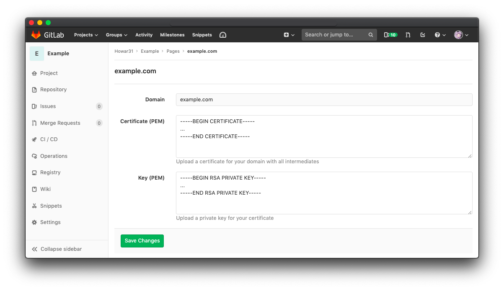
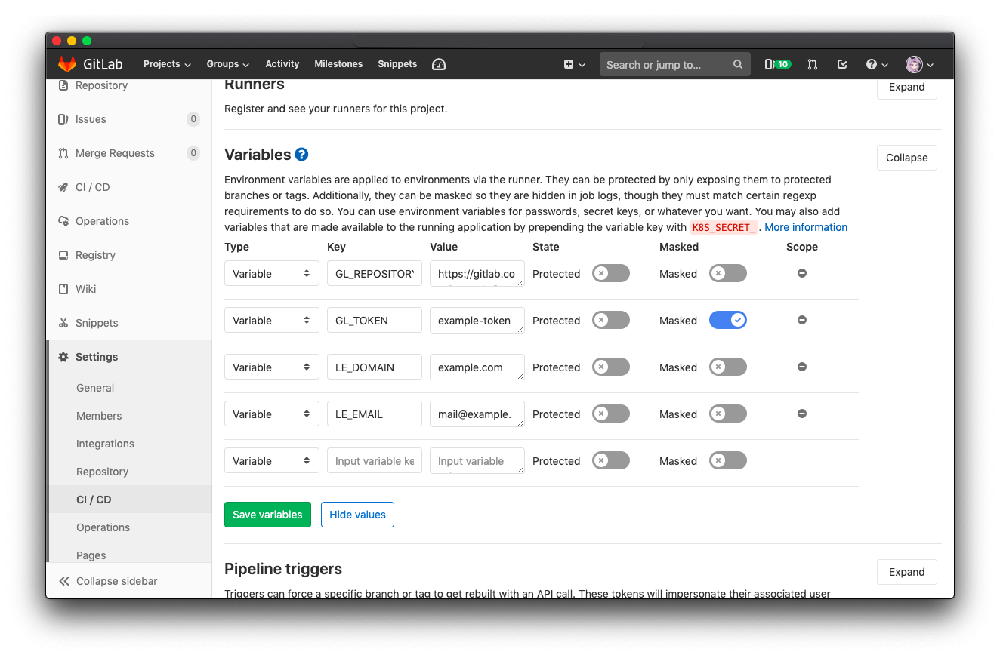
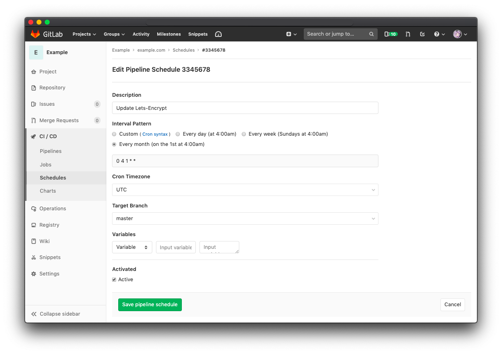

# Secure GitLab Pages with Let's Encrypt Certificate

::: tip Edit - 2019.06.25

- Add [About Getting Certificates on Let's Encrypt](#automatically-renew-and-deploy-certificate-on-gitlab-pages) section.
- Add [Automatically Renew and Deploy Certificate on GitLab Pages](#automatically-renew-and-deploy-certificate-on-gitlab-pages) section.
- Add [References](#references) section.
- Fix typo.

:::

Using SSL to secure your website is not only for safety, but also [tell browser not show your website as not secure](https://blog.chromium.org/2017/04/next-steps-toward-more-connection.html).  **Let's Encrypt** provides free SSL/TSL cerfiticates as long as you remember to renew them once in a while.  And wildcard certificates can be applied to all the subdomains.

In this article, I will show you how to apply for a certificate on Let's Encrypt, and set it on GitLab Pages.

## Environment & Requirements

Environment for following instructions:

- macOS Mojave, 10.14.3
- Homebrew 2.0.5
  - Homebrew/homebrew-core (git revision 528fa; last commit 2019-03-22)
  - Homebrew/homebrew-cask (git revision f9c58; last commit 2019-03-16)
- certbot 0.32.0

Of course, you will have to own a domain before you can apply a certificate on it.

## About Getting Certificates on Let's Encrypt

### Certificate Types

There are 2 types of SSL certificate, regular and wildcard.  

#### Regular SSL Certificates

The regular ssl certificate will issue to your specific domain.  And you may only use the certificate on that specific domain.  For example: `blog.example.com`.

#### Wildcard Certificate

While wildcard certificate will allow you to use the certificate on all subdomains you have.  For example: `*.example.com`.

### Challenges

Let's Encrypt needs you to prove that the website/domain is owned by you before issuing the certificates, the verification process is called **Challenge**.  There are currently 2 types of challenges are commonly used as of the time of writing.

For more detail about challenges, please visit [the official Let's Encrypt document](https://letsencrypt.org/docs/challenge-types/).

#### HTTP-01

`HTTP-01` is used to verify that the website is under your control.  You will need to upload a specific file with specific content to the specific path on your website.  Let's Encrypt (certbot) will tell you what to put and where to put, and after that it will check if you have fulfill the challenge or not.

This method is easy to be done since you only need to put file on the web server.  You don't need to deal with complicated server configurations.  But note that this challenge can only be done on port 80 for security reason.

#### DNS-01

`DNS-01` is usually used while you want to get a wildcard certificate.  This challenge will ask you to prove that the DNS for your domain is under your control by putting a specific TXT record on the domain.

This method is more complicated since you have to config the DNS settings.  But it can offer you a wildcard certificate.  Please note that you must pass this challenge if you want to get a wildcard certificate, since HTTP-01 cannot prove you own the domain.

### Modes

We will use **certbot**, a tool provided by Let's Encrypt, to request a certificate.  There are 2 modes for certbot to get the certificates: Manual Mode and Auto Mode.

#### Manual Mode

The Manual Mode is simple.  You apply the certificate with interactive shell to get pass the challenge.  But the certificates issued by Let's Encrypt expire after 3 months.  Which means you will need to renew the certificates every 3 months.  So you might want to use Auto Mode to get the certificates.

#### Auto Mode

By using [certbot plugins](https://certbot.eff.org/docs/using.html#getting-certificates-and-choosing-plugins), you may pass the challenges automatically and also update the certificates on your Apache/Nginx servers.  To get certificates by Auto Mode, you will need plugin support (or host support) to auto fulfill the challenges and update your certificates.

## Obtaining a Wildcard Certificate with Manual Mode

In the following tutorial, I will show you how to get a wildcard certificate and set it on GitLab Pages with manual mode.

::: tip
I haven't find a way to **automatically** renew the **wildcard** certificate and deploy it on GitLab Pages.  If you know how to do it please tell me!
:::

### Get Wildcard Certificate from Let's Encrypt

First, install certbot:

```bash
brew install certbot
```

and request a certificate:

```bash
sudo certbot certonly -a manual -d *.example.com --email your@email.com
```

remember to change the `*.example.com` and `your@email.com` to your own.  Note that `*.` before your domain is **required** for requesting a wildcard certificate.

Now the certbot will ask you soome question and provide the verification instruction:

```
Saving debug log to /var/log/letsencrypt/letsencrypt.log
Plugins selected: Authenticator manual, Installer None

- - - - - - - - - - - - - - - - - - - - - - - - - - - - - - - - - - - - - - - -
Please read the Terms of Service at
https://letsencrypt.org/documents/LE-SA-v1.2-November-15-2017.pdf. You must
agree in order to register with the ACME server at
https://acme-v02.api.letsencrypt.org/directory
- - - - - - - - - - - - - - - - - - - - - - - - - - - - - - - - - - - - - - - -
(A)gree/(C)ancel: a
```

press `a` to agree the terms.

```
- - - - - - - - - - - - - - - - - - - - - - - - - - - - - - - - - - - - - - - -
Would you be willing to share your email address with the Electronic Frontier
Foundation, a founding partner of the Let's Encrypt project and the non-profit
organization that develops Certbot? We'd like to send you email about our work
encrypting the web, EFF news, campaigns, and ways to support digital freedom.
- - - - - - - - - - - - - - - - - - - - - - - - - - - - - - - - - - - - - - - -
(Y)es/(N)o: n
```

press `n` if you don't want to subscribe the EFF news letter.

```
Obtaining a new certificate
Performing the following challenges:
http-01 challenge for example.com

- - - - - - - - - - - - - - - - - - - - - - - - - - - - - - - - - - - - - - - -
NOTE: The IP of this machine will be publicly logged as having requested this
certificate. If you're running certbot in manual mode on a machine that is not
your server, please ensure you're okay with that.

Are you OK with your IP being logged?
- - - - - - - - - - - - - - - - - - - - - - - - - - - - - - - - - - - - - - - -
(Y)es/(N)o: y
```

press `y` to agree the IP logging.

```
- - - - - - - - - - - - - - - - - - - - - - - - - - - - - - - - - - - - - - - -
Please deploy a DNS TXT record under the name
_acme-challenge.example.com with the following value:

sdfa81NrRvsI3afw8jFeULwefi81723n98FHEfwf813elwf

Before continuing, verify the record is deployed.
- - - - - - - - - - - - - - - - - - - - - - - - - - - - - - - - - - - - - - - -
Press Enter to Continue
Waiting for verification...
```

**DO NOT PRESS ENTER** for now, Let's Encrypt will have to verify you own the domain.  So you have to create a `TXT` record with name `_acme-challenge.example.com` and value `sdfa81NrRvsI3afw8jFeULwefi81723n98FHEfwf813elwf` (your value may vary) in your DNS. (I assume you know how to do that since you own a domain)

After creating the record, you may use some online tools to see the `TXT` record is properly set or not.  Then get back to your terminal and press **ENTER** to continue.

If Let's Encrypt successfully verified your record, the certbot will say:

```
Cleaning up challenges

IMPORTANT NOTES:
 - Congratulations! Your certificate and chain have been saved at:
   /etc/letsencrypt/live/example.com-0001/fullchain.pem
   Your key file has been saved at:
   /etc/letsencrypt/live/example.com-0001/privkey.pem
   Your cert will expire on 20xx-xx-xx. To obtain a new or tweaked
   version of this certificate in the future, simply run certbot
   again. To non-interactively renew *all* of your certificates, run
   "certbot renew"
 - If you like Certbot, please consider supporting our work by:

   Donating to ISRG / Let's Encrypt:   https://letsencrypt.org/donate
   Donating to EFF:                    https://eff.org/donate-le
```

as the message said, your wildcard certificate is now stored as `fullchain.pem` and `privkey.pem`.  Please keep the files if you need to put it on your own web server.

For setting the certificate on GitLab Pages, please read on.

### Set the Certificate on GitLab Pages

Open your GitLab project and go to **Settings > Pages**.  Find your own domain and click **Details > Edit**.



Copy your `fillchain.pem` to clipboard:

```bash
sudo cat /etc/letsencrypt/live/example.com-0001/fullchain.pem | pbcopy
```

and paste it into the first field **Certificate (PEM)**.

Then copy your `privkey.pem` to clipboard:

```bash
sudo cat /etc/letsencrypt/live/example.com-0001/privkey.pem | pbcopy
```

and paste it into the second field **Key (PEM)**.

Click **Save Changes**, and wait for about 10 minutes for DNS propagation.

You may also enable **Force domains with SSL certificates to use HTTPS** in **Settings > Pages**.

## Automatically Renew and Deploy Certificate on GitLab Pages

With the above tutorial,  you can apply a wildcard certificate on GitLab Pages.  But renew it every 3 months will drive you crazy eventually.  So we do need a automatic solution.

As I said previously, I haven't find a way to *automatically* renew the *wildcard* certificate and deploy it on GitLab Pages.  But I do find a way to automatically renew a **regulay certificate** and update it on GitLab Pages with the help of **GitLab CI/CD** and npm package **gitlab-letsencrypt**!

### NPM Package gitlab-letsencrypt

[gitlab-letsencrypt](https://www.npmjs.com/package/gitlab-letsencrypt) is a npm package which can help you to renew the certificate and apply it on GitLab Pages automatically.  It use GitLab CI to pass HTTP-01 challenges, and use GitLab API to update your GitLab Pages' certificate.

How it works detail is described in [package document](https://www.npmjs.com/package/gitlab-letsencrypt#how-it-works):

1. Requests a challenge from Let's Encrypt using the provided email address for the specified domains. One challenge file is generated per domain
2. Each challenge file is uploaded to your GitLab repository using GitLab's API, which commits to your repository
3. The challenge URL is repeatedly polled until the challenge file is made available. GitLab Pages take a while to update after changes are committed
4. If Let's Encrypt was able to verify the challenge file, a certificate for that domain is issued
5. Each challenge file is removed from your GitLab repository by committing to it through the GitLab API
6. If --production was set, your GitLab page is configured to use the issued certificate

In summary, the gitlab-letsencrypt will trigger the HTTP-01 challenge, and upload the file for verification, and delete the file after challenge passed.  And then use GitLab API to update the certificate for your GitLab Pages.

### Setup GitLab CI

We first need modify your CI file.  As you might already have CI for GitLab Pages, append the new job to the CI file.

```yaml {12-22}
pages:
  stage: deploy
  script:
    - mkdir .public
    - cp -r * .public
    - mv .public public
  artifacts:
    paths:
    - public
  only:
    - master
  except:
    - schedules

lets-encrypt:
  stage: deploy
  image: node:8
  script:
    - npm install -g gitlab-letsencrypt
    - gitlab-le --production --email $LE_EMAIL --domain $LE_DOMAIN --repository $GL_REPOSITORY --token $GL_TOKEN
  only:
    - schedules
```

Add a new job `lets-encrypt` to your `.gitlab-ci.yml` file.  The `except` in `pages` and `only` in `lets-encrypt` is set to `schedules` which means the job will only be execute on `schedules` and won't be executed in `master`.

In the script above, we use GitLab variables (`$LE_EMAIL`, `$LE_DOMAIN`, `$GL_REPOSITORY`, `$GL_TOKEN`) to keep those config values private.  Go to project `Settings > CI/CD > Variables` to fill up the values.



And thejn go to project `CI/CD > Schedules` to setup a schedule for this job.  Set it to run once per month will be enough since Let's Encrypt certificate expire in 3 months.



And that's all, save the pipeline schedule and everything is done.  You may run the schedule manually to verify the job is set correctly.  And the schedule will also be triggered once a month to automatically renew your certificate.

## References

### Official Docs

- [Let's Encrypt for GitLab Pages](https://docs.gitlab.com/ee/user/project/pages/lets_encrypt_for_gitlab_pages.html)
- [Certbot documentation](https://certbot.eff.org/docs/)

### Community Posts

- [Let's Encrypt GitLab Pages And automate the process](https://arothuis.nl/posts/lets-encrypt-gitlab-pages/)
