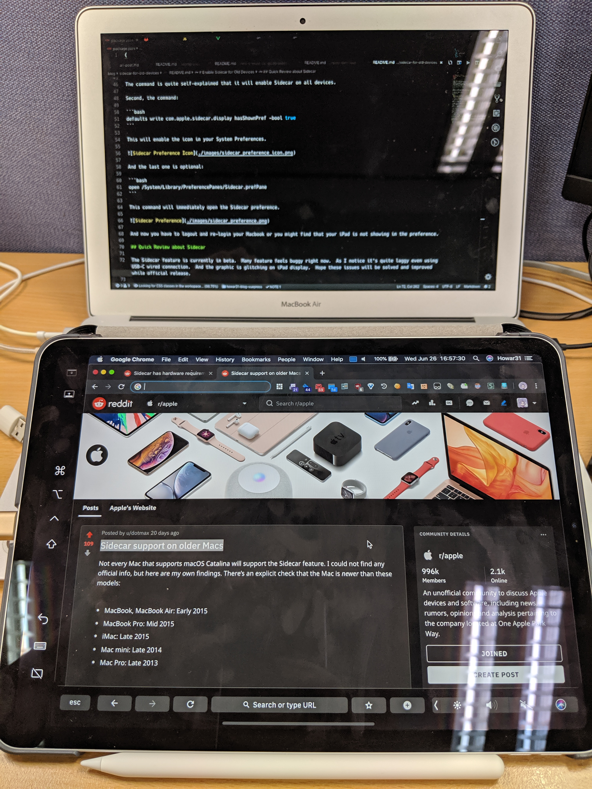
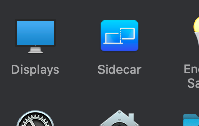
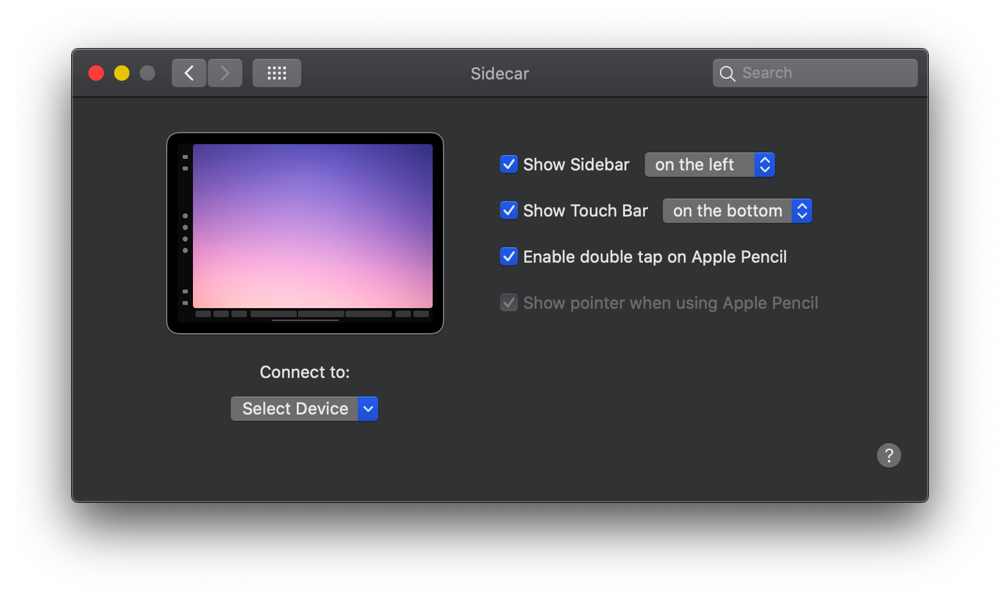

# Enable Sidecar for Old Devices

The public beta of iPadOS and macOS Catalina is currently live for everyone now.  You may go to [Apple website](http://beta.apple.com/) for more detail info about public beta.

The Sidecar is a hot feature which let you connect your iPad to Mac wireless or wired.  But this feature is actually limited to newer Apple devices.  My Macbook Air Early 2015 was not showing the "Sidecar" icon in System Preference, neither my iPad Pro 11" showing up in my MBA's AirDisplay menu.

Fortunately, we can manually enable the Sidecar support on older devices with terminal commands.

## Enable Sidecar with Terminal Commands

### TL;DR for One-liner

```bash
defaults write com.apple.sidecar.display AllowAllDevices -bool true; defaults write com.apple.sidecar.display hasShownPref -bool true; open /System/Library/PreferencePanes/Sidecar.prefPane
```

Then logout and re-login your macbook.

### Commands Explain

My devices:

- MacBook Air (13-inch, Early 2015)
  - macOS Catalina 10.15 Beta (19A487m)
- iPad Pro 11" (MTXP2TA/A)
  - iPadOS 13.0 (17A5508m)

I've tried the following commands and successfully connect my iPad Pro to my Macbook Air.



First, open terminal on your macbook and use this command:

```bash
defaults write com.apple.sidecar.display AllowAllDevices -bool true
```

The command is quite self-explained that it will enable Sidecar on all devices.

Second, the command:

```bash
defaults write com.apple.sidecar.display hasShownPref -bool true
```

This will enable the icon in your System Preferences.



And the last one is optional:

```bash
open /System/Library/PreferencePanes/Sidecar.prefPane
```

This command will immediately open the Sidecar preference.



And now you have to logout and re-login your Macbook or you might find that your iPad is not showing in the preference.

## Quick Review about Sidecar

The Sidecar feature is currently in beta.  Many feature feels buggy right now.  As I notice it's quite laggy even using USB-C wired connection.  And the graphic is glitching on iPad display.  Hope these issues will be solved and improved while official release.

## References

- [Reddit - Sidecar support on older Macs](https://www.reddit.com/r/apple/comments/bx3eet/sidecar_support_on_older_macs/)
