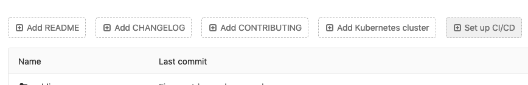

# Create a Blog with VuePress on GitLab Pages

After several years hosting my blog on Wordpress, I decided to move my blog to VuePress so that I may write my blog with Markdown, and also customize my blog with Vue.js.

VuePress is a Vue-powered static site generator, which can easily help you to setup a SPA website in just few minutes.  And with CI/CD and GitLab Pages integration, it becomes one of the best solution for personal blog which can be programmatically themed with Vue.js, automatically publish with CI/CD, and free host with GitLab Pages.

There are tons of *VuePress + GitLab Pages* tutorials on the web already.  In this article, I will focus on how I setup my blog with minimal customization on default VuePress theme, and how to migrate the old posts from Wordpress to VuePress.

## So why VuePress and GitLab Pages?

Sum up the main reasons why I choose this solution bundle:

- **Static site generator**, which means my blog will be blazing fast to load and browse since it's all pre-rendered HTML, JS and CSS.  Futhermore, VuePress is powered by Vue.js which is a SPA framework that provides even better browsing experience.
- **Markdown** is easy and fast to write a document ***with basic formatting like this***.  And also keeping blog posts as files (rather than DB records) is good for future migration to different content management system (or even just files are ready to read).
- **CI/CD** is convenient to get things done automatically.  With CI/CD set on GitLab, you just need to save your file and commit/push to git and it's done (especially good for developers who are familiar with git).  The workers (we called runners on GitLab) will handle all the tests, jobs, and deployments by themselves.
- **Money** is always a factor to consider while we choose what we want.  Hosting static webpages with custom domain and [tons of great features](https://about.gitlab.com/product/pages/) on GitLab is just **free**, even with a private repo.  (shouting out to GitHub)

and lots more to say.  Anyways these are my concerns, ymmv.

## Environment

I built my blog with these environment settings:

- Macbook Air 2015 Early
- macOS Mojave, 10.14.3
- Nginx 1.12.1
- Node.js 11.11.0
- npm 6.9.0
- VSCode 1.32.3

and the following setup steps will base on this environment setup.

## Setup VuePress

Let's start with VuePress.  You may also checkout [VuePress Official Website](https://vuepress.vuejs.org/) for detail documents.

### Install VuePress

First, install VuePress globally:

```bash
npm install -g vuepress
```

Create a Markdown file `README.md` as homepage:

```bash
echo '# Hello VuePress' > README.md
```

::: tip
Accroding to [official document](https://vuepress.vuejs.org/guide/markdown.html#links), VuePress will parse `README.md` or `index.md` to `index.html` while generating static webpages.

For more info about README and index please visit [here](https://github.com/vuejs/vuepress/pull/23).
:::

Quickly preview your site with a temp web server:

```bash
vuepress dev
```

::: warning
As of the time of writing, [there was a bug](https://github.com/vuejs/vuepress/issues/1417) in webpack-dev-middleware which prevents this command to establish the temp dev web server.  To work around this, you may build the static HTML files and host them with your own web server, such as Apache or Nginx.
:::

To build the static HTML files, simply run:

```bash
vuepress build
```

and the HTML files will be generated to `.vuepress/dist` by default.

And that's it, this is the minimal setup for VuePress.  You may now see a simple webpage which is generated with your Markdown content.

### Config Build Path

Before continue to GitLab Pages setup, there are some configs to set for easy CI/CD in the next step.  These configs are optional, I will show you my setup here.

To change the built files destination, we must set it up in config file.  By default the config file is not exist, you may create a config file by yourself:

```bash
vi .vuepress/config.js
```

`config.js` file contains all the VuePress site-wide settings.  It will be loaded before parsing any Markdown pages.

Put this content into `config.js` to setup the built files destination:

```javascript
module.exports = {
    title: 'Howar31 Blog',
    dest: 'public',
}
```

The `title` is the title of the site.

The `dest` path is based on your file's root, that is, your built files will now be put in `./public` instead of `.vuepress/dist`.

We change the `dest` to `public` since GitLab Pages use `public` as artifacts folder.  Of course, you may change the GitLab Pages artifacts folder to `.vuepress/dist` instead, if you don't want to set the `dest` in VuePress here.

::: tip
If you are hosting the blog other than root url, please set the base url `base: 'path/to/site'` in `config.js`.
:::

This is the minimal `config.js` setting for VuePress.

### Config npm (package.json)

In order to manage dependencies, create a `package.json` at root folder.

```json
{
  "main": "index.js",
  "directories": {
    "blog": "blog"
  },
  "scripts": {
    "blog:build": "vuepress build blog"
  },
  "dependencies": {
    "vuepress": "^0.14.10",
    "moment": "^2.24.0",
    "yaml-front-matter": "^4.0.0"
  }
}
```

The `directories` will be the folder where to save all the blog posts.  In this case, `./blog/` will be the root for all my blog posts.

The `scripts` includes npm commands.  Create a `blog:build` command which will execute `vuepress build blog`.  The command `vuepress build` can accept a parameter which will indicate the Markdown files in what folder to build.  In other words, the parameter is the path to document root.

The `dependencies` includes which version of the VuePress you want to install (for CI/CD), and all other optional npm packages.  In the example above, I use VuePress 10.14.10, and also includes `moment` and `yaml-front-matter` packages for later customization.

After saving the `package.json`, you may try to run the commands to install the dependencies:

```bash
npm install
```

and the script `blog:build` to build the static files:

```bash
npm run blog:build
```

These commands will also be used by GitLab CI/CD runner which will be illustrated later.

::: tip
Note that since we changed the `dest` in `config.js` and `directories` in `package.json`.  VuePress will now find Markdown files in `./blog/` and generate the static HTML files to `./public/`.

You have to create blog posts (Markdown files) in `./blog/` so that VuePress can find them.  And the '.vuepress/dist` mentioned above are now safe to remove since the static HTML files are now in their new home.
:::

## Setup GitLab Pages

GitLab is an open-source web-based git repository manager which also provides DevOps lifecycle tool, wiki, issue-tracking, CI/CD pipeline and [more](https://gitlab.com/).  And GitLab provide a free static site hosting service called **GitLab Pages**, which is quite similar with GitHub Pages, but with much more customization options (with their CI/CD integration).

### Config GitLab CI/CD

First of all, you have to create a GitLab account if you don't have one.  And then create a new repository to host your VuePress project.

In the project view, where is a `Set up CI/CD` button, click it.



or you can create a file `.gitlab-ci.yml` manually.  Edit the file with the content below:

```yaml
image: node:latest
pages:
  cache:
    paths:
    - node_modules/
  script:
    - npm install
    - npm run blog:build
  artifacts:
    paths:
      - public
  only:
    - master
```

This YAML file is GitLab CI/CD setup.  You may read the [quick start by GitLab official](https://docs.gitlab.com/ee/ci/quick_start/).  For detail configuration please visit [another official document](https://docs.gitlab.com/ee/ci/yaml/README.html).

The [shared runner](https://docs.gitlab.com/runner/) on gitlab.com is in docker mode.  The `image` will told the runner use `node:latest` docker image.

::: tip
GitLab.com provides several shared runners and free to use with [limited pipeline quota](https://gitlab.com/help/user/admin_area/settings/continuous_integration#shared-runners-build-minutes-quota).  But if you want to use your own runners, or hosting the GitLab CE by yourself, you have to configure the runners by yourself.
:::

The `pages` is the job name.  This is a special job name [that you cannot change](https://docs.gitlab.com/ee/ci/yaml/README.html#pages).  With this job name, GitLab will upload and deploy your static contents to GitLab Pages.

The files in `cache`'s `paths` will be uploaded to GitLab server.  And will be downloaded to docker container while running the pipeline next time.  Here we told GitLab to keep the `node_modules` folder to avoid fresh npm install each time we run the pipeline.

The `script` contains the commands to run.  And we build VuePress here.

The files in `artifacts`'s `path` will be uploaded to GitLab Pages.  So here we should put our static HTML files.  This is why we changed the VuePress `dest` from `./vuepress/dist` to `public`.

The `only` means this pipeline will only be run if the branch is `master`.

Save and commit the files.  Then the GitLab CI/CD is ready.

For more details about CI/CD deployment for different static generators, please see the [official page example](https://gitlab.com/pages).

### Config Git

Add `.gitignore` to ignore some generated files:

```
node_modules
/public/
```

### Config GitLab Pages

Actually there are nothing more to setup if your CI/CD is set correctly.  You may see if the job succeed or failed in `CI/CD > Pipelines` in GitLab project page.

To access your built blog, go to `Settings > Pages` in project page.

::: tip
If you are using self-hosted GitLab CE, please note that you need to enable the Pages features in Admin Area (ask your admin if you don't know what is this).  Otherwise, you won't be able to find th `Pages` in `Settings`.
:::

And you will see your blog url (the default is `USER_NAME.gitlab.io/PROJECT_NAME`).

::: tip
GitLab Pages takes about 10 to 30 minutes while deploying your blog.  And it will take longer if you have just set up your custom domain (flush DNS helps maybe).  Please wait a little while if you see 404.

But if you still see 404 after hours, please check your CI/CD settings to see whether the job succeed and the artifacts uploaded to GitLab are not empty (or gibberish).
:::

In the Pages settings, you may also find some configs you can tune, such as force HTTPS, custom domains, and disable the Pages for this project.

## Write a Blog Post

At this point, your *VuePress + GitLab Pages* pipeline are all set.  As long as you push a commit to GitLab, the pipline will be run and your blog will be updated.

The directory structure should be:

```
.
├ blog/
│ ├ .vuepress/
│ └ README.md
├ node_modules/
├ public/
├ .gitignore
├ .gitlab-ci.yml
├ package.json
├ package-lock.json
└ README.md
```

To create a new blog post, simply create a new folder under the `blog` folder.  And then create a `README.md` under that new folder.  Also a `images` folder if you want to have some images in your post.  For example:

```{4-6}
.
├ blog/
│ ├ .vuepress/
│ ├ new-post/
│ │ ├ images/
│ │ └ README.md
│ └ README.md
├ node_modules/
├ public/
├ .gitignore
├ .gitlab-ci.yml
├ package.json
├ package-lock.json
└ README.md
```

Write the Markdown in `README.md`, and put your images in `images` folder.  To link the image `filename.jpg` (for example) in Markdown, simply write:

```markdown

```

and the image will be loaded.

Due to the file path, the url of the new post will be `http://example.com/new-post/`.

::: tip
VuePress 0.x URL is stick to the file path.  In future VuePress 1.x, there will have options for permalinks.  In this article, I use 0.x as example since 1.x is still unstable.
:::

In Markdown file, VuePress support [YAML front matter](https://vuepress.vuejs.org/guide/markdown.html#front-matter).  The data will be available in this page and also usable by Vue layout and components.

For VuePress default theme, `title`, `lang` and `meta` will automatically be set on the page.  And I also add `date` for blog post of course.  It will be used later in blog post index and sidebar generation (illustrate later).

Recommand new blog post template:

```yaml
---
title: POST_TITLE
date: YYYY-MM-DD
---

# POST_TITLE

POST_CONTENT
```

After the YAML front matter, all other content will be parsed by Markdown parser.

::: tip
VuePress use [markdown-it](https://github.com/markdown-it/markdown-it) as the Markdown parser, which can also be further configured accroding to [official document](https://vuepress.vuejs.org/config/#markdown).
:::

In addition to Markdown, you may also write HTML (not recommanded), and place Vue components in Markdown files.

## Customize VuePress

VuePress looks elegant even with the default theme without any customization.  But if you want to make it personal, you will need some tweaks and configs.

If you are an UI/UX designer, you may want to fully customize and redesign how the VuePress looks.  And yes you can do it by [eject the default theme](https://vuepress.vuejs.org/default-theme-config/#ejecting) and start modify them by yourself.  But in order to receive future update from VuePress official, I'd rather to use default theme with slightly override.

### Enable Navbar and Sidebar

With default VuePress installation, there is no way for visitor to navigate between posts.  You may config navbar and sidebar to solve this issue.

#### Config Navbar

We will start with navbar.  All VuePress site-wide configs are in `.vuepress/config.js`.  Edit it and add `nav` to `themeConfig` section:

```javascript
themeConfig: {
  nav: [
    { text: 'Link to File', link: '/filename.md' },
    { text: 'Link to Path', link: '/path/' },
    {
      text: 'Dropdown', items: [
        {
          text: 'Group 1', items: [
            { text: 'Link to File', link: '/filename.md' },
            { text: 'Link to Path', link: '/path/' },
          ],
        },
        {
          text: 'Group 2', items: [
            { text: 'External Link', link: 'https://google.com' },
            { text: 'External Link 2', link: 'https://vuepress.vuejs.org' },
          ],
        },
      ]
    }
  ],
}
```

Example above shows that the navbar items supports serveral types of link:

- **Link to File** will simply create a link point to the file you assigned.
- **Link to Path** will try to find `README.md` or `index.md` under that path
- **Dropdown** is a nested menu, and can furtuer be nested with **Group**

For more details about navbar config, you may read the [official guide](https://vuepress.vuejs.org/default-theme-config/#navbar).

#### Config Sidebar

Sidebar has more features than navbar.  That means the config will be slightly complicated:

```javascript
themeConfig: {
  sidebar: {
    '/path/',
    '/file-a',
    ['/file-b', 'Explicit link text']
  },
},
```

Example above shows that you may point the link to path (closed with `/` will try to find `README.md` under that path) and to file (`.md` can be omitted).

With this setup, you may manually link your blog posts in sidebar.  But that's stupid to add a link manually each time you write a new post.  So I wrote some script to do this job.

You can add custom Javascript at the beginning of the `.vuepress/config.js` which will be loaded before any Markdown page is parsed.

```javascript
const fs = require('fs');
const moment = require('moment');
const yamlFront = require('yaml-front-matter');

const sortDelimiter = ';';

/**
 * Generate sidebar array
 * @param {array} markdownPaths contains an array list of file paths
 * @param {bool} sort sort the output array by 'date' in YAML header descendantly or not
 * @param {int} limit limit the returned results, 0 will return all results
 */
function generateSidebar(markdownPaths, sort = true, limit = 0) {
  let renderedPosts = new Array();

  if (sort) {
    markdownPaths.forEach(filePath => {
      fileContents = fs.readFileSync(filePath, 'utf8').toString();
      fileMeta = yamlFront.loadFront(fileContents);
      if (fileMeta.blog_index == true) return;
      fileTimestamp = moment(fileMeta.date);
      renderedPosts.push(fileTimestamp + sortDelimiter + filePath);
    });
    renderedPosts = renderedPosts.sort().reverse();
    if (limit > 0) {
      renderedPosts = renderedPosts.slice(0, limit);
    }
    renderedPosts.forEach((sortedPath, index, array) => {
      array[index] = sortedPath.substring(sortedPath.indexOf(sortDelimiter) + sortDelimiter.length + basePath.length, sortedPath.lastIndexOf('/')) + '/';
    });
  } else {
    renderedPosts = markdownPaths.map(filePath => filePath.substring(basePath.length, filePath.lastIndexOf('/')) + '/');
  }

  return renderedPosts;
}
```

This function will parse your Markdown files and generate a sidebar array accrodingly.  So that you don't need to setup the sidebar items manually.

First of all, I used 3 node modules:

- [File System (fs)](https://nodejs.org/api/fs.html) to read the files.
- [Yaml Front Matter(yaml-front-matter)](https://www.npmjs.com/package/yaml-front-matter) to parse the YAML front matter in files read by fs
- [Moment.js (moment)](https://momentjs.com/) to handle the datetime object.

You can install and save them to package.json by:

```bash
npm install yaml-front-matter --save
npm install moment --save
```

Before the parameters, I use a flag `blog_index` to tell this function to skip some specific files so that the files won't show up in the sidebar.  It's useful if the file is not a post and you want to ignore it.  To set this flag in your Markdown file, add this in YAML front matter:

```yaml
---
blog_index: true
---
```

The `sort` parameter, you may decide to sort the output array by date in YAML or not.  Since it's a blog, we will set this parameter to true.

And the `limit` parameter can limit the output count.  It's useful if you want to get *5 latest posts* in your blog.

And about the `markdownPaths` parameters, you have to pass an array which contains a list of file paths you want to be generated in sidebar.

This function will return an array which you can insert it directly into the sidebar config, like:

```javascript
let blogPosts = generateSidebar(blogPaths, true, 5);
module.exports = {
  themeConfig: {
    sidebar: blogPosts,
  },
}
```

and this will just work, which shows 5 latest posts in the sidebar.

Back to the `markdownPaths` parameter again, you don't have to create this path list manually, just let glob do the job:

```javascript
const glob = require('glob');
const basePath = 'blog';
let blogPaths = glob.sync(basePath + '/*/*.md');
let blogPosts = generateSidebar(blogPaths, true, 5);
```

Remember the directory structure?

```{4-6}
.
├ blog/
│ ├ .vuepress/
│ ├ new-post/
│ │ ├ images/
│ │ └ README.md
│ └ README.md
├ ...
```

We create a post by creating a folder first then place the Markdown files inside.  So `basePath + '/*/*.md'` will parse all the first-level folder in `basePath` and find the Markdown files.  Of course, the `basePath` is `blog` which we set in `directories` in `package.json`.  By changing the path in `sync()`, you may traverse through the directory you want and generate the sidebar for that directory.

Furthermore, you may ultilize the *Multiple Sidebar* VuePress provided.  And combine with specific items you want to show on all sidebar.  Such as:

```javascript
let blogPaths = glob.sync(basePath + '/*/*.md');
let blogPosts = generateSidebar(blogPaths, true, 5);

let archivedPaths = glob.sync(basePath + '/archived/*/*.md');
let archivedPosts = generateSidebar(archivedPaths, true, 5);

let generalSidebar = [
    '/',
];

module.exports = {
  themeConfig: {
    sidebar: {
      '/archive/': generalSidebar.concat([archivedPosts]),
      '/': generalSidebar.concat([blogPosts]),
    }
  },
}
```

For more details about sidebar config, you may read the [official guide](https://vuepress.vuejs.org/default-theme-config/#sidebar).

### Custom Components

VuePress is powered by Vue.js.  So obviously Vue components will work in VuePress.  In this section, I will create a component which can show a post list as a basic example of how to create a Vue component in VuePress and how to use it.

#### Create a Component

To create a component, you need to create `.vuepress/components` first, and put all your component `.vue` files inside.  Let's create a `BlogIndex.vue` component:

```{4-5}
.
├ blog/
│ ├ .vuepress/
│ │ └ components/
│ │   └ BlogIndex.vue
│ └ README.md
├ ...
```

A basic component can have three sections:

- **`<template>`** is the HTML part of the component
- **`<style>`** apparently is the CSS part
- **`<script>`** is the Javascript part, and where the Vue script will be in

First we create the HTML which contains a table to show the post list:

```html
<template>
<div>
  <table class = "blog-index-list">
    <tbody>
      <tr v-for="post in posts">
        <td>{{ formateDate(post.frontmatter.date) }}</td>
        <td><router-link :to="post.path">{{ post.frontmatter.title }}</router-link></td>
      </tr>
    </tbody>
  </table>
</div>
</template>
```

And the style to format the list:

```html
<style scoped>
.blog-index-list {
  display: table;
  width: 100%;
  table-layout: auto;
}
.blog-index-list td {
  overflow: hidden;
  text-overflow: ellipsis;
}
.blog-index-list td:first-child {
  width: 1px;
  white-space: nowrap;
}
</style>
```

I set the `table` with `table-layout: auto;`, then set the first `td` with `width: 1px; white-space:nowrap;`.  This will make the first column of the table to automatically adjust the width to fit the content by itself.

And the `posts` used above in template is a computed property:

```html
<script>
import moment from "moment"

export default {
  props: [
    'limit',
  ],
  methods: {
    formateDate(date, format = 'YYYY-MM-DD') {
      return moment(date).format(format)
    },
  },
  computed: {
    posts() {
      let posts = this.$site.pages
        .filter(post => !post.frontmatter.blog_index)
        .filter(post => !post.path.startsWith('/archived/'))
        .sort((a, b) => new Date(b.frontmatter.date) - new Date(a.frontmatter.date));

      if (this.limit > 0) {
        posts = posts.slice(0, this.limit);
      }

      return posts;
    }
  }
}
</script>
```

This component accept a property called `limit` which will use to limit the output count of the posts if set.  And I used *Moment.js* for date formatting and post sorting.

The `this.$site` is generated by VuePress which contains the site meta data.  And there is also a `this.$page` which contains the page meta data.  For more details, please read the [official document](https://vuepress.vuejs.org/guide/custom-themes.html#site-and-page-metadata).

#### Use a Component

To use a component in your Markdown files, simply write:

```markdown{5}
## Recent Posts

Here are the 5 most recent posts.

<BlogIndex category="current" limit="5" />
```

and the component will be loaded into your webpage.

### Override CSS Styles

Override the default theme CSS style instead of creating a whole new theme, allows you to keep receiving the updates and bug fixes for VuePress official.  By default, VuePress use [Stylus](http://stylus-lang.com/).  But you can also write CSS in .styl files.

To override the CSS style, create `.vuepress/override.styl` and `.vuepress/style.styl` files:

```{4-5}
.
├ blog/
│ ├ .vuepress/
│ │ ├ override.styl
│ │ └ style.styl
│ └ README.md
├ ...
```

In `override.styl`, only override the default variables of the default theme:

```stylus
// showing default values
$accentColor = #3eaf7c
$textColor = #2c3e50
$borderColor = #eaecef
$codeBgColor = #282c34
```

And write your custom styles in `style.styl`.  Note that you can create custom variables and import other .styl files:

```stylus
@import "another-style.styl"

$myColor = #FFFFFF;
$anotherColor = #000000;
```

These two files will be loaded automatically and applied to your VuePress.

## Migrate from Wordpress to VuePress

I've hosted my blog on Wordpress for several years.  And I want to keep my old posts while moving to new blog.  Fortunately, I found this tools to help me to convert my Wordpress posts to Markdown files:

[wordpress-export-to-markdown](https://github.com/lonekorean/wordpress-export-to-markdown) by [lonekorean](https://github.com/lonekorean)

Before using this tool, you will have to:

- Install [Node.js](https://nodejs.org/) v10.12+
- [Export your Wordpress posts to XML file](https://codex.wordpress.org/Tools_Export_Screen)

and clone this project to a folder:

```bash
git clone git@github.com:lonekorean/wordpress-export-to-markdown.git
```

then run the commands:

```bash
npm install
node index.js
```

and it will create a folder `./output` which contains all your posts in Markdown and the images that were added by dragging/dropping or clicking Add Media or Set Featured Image when editing a post in Wordpress.

And here you go, copy the files in `output` to your site generator's folder.

::: tip
Note that, although the images are downloaded, they are not linked in Markdown files.  That is, all the image links in Markdown files ares still point to the old URL.  You will have to edit them to new URL (the downloaded images path) manually.
:::

## Conclusion

VuePress is a new but powerful static site generator.  With GitLab powerful CI/CD support, you may easily create a static website in minutes.  There are still lots of options for customizing your VuePress.  And as VuePress is still under active development, lots of new features are coming in the near future.  Please remember to visit the [official VuePress website](https://vuepress.vuejs.org) (which is also built with VuePress itself) and read the documents there.

## Future Works

In this article, I demonstrated how to build a blog with VuePress 0.14.10.  As of the time of writing, the [VuePress 1.x](https://v1.vuepress.vuejs.org/) is under development which is still in Alpha state (1.0.0-alpha.44 so far).  VuePress 1.x has more customization options, such as plugins, themes, permalinks, etc.  But it's still not stable yet that the site might crash under some circumstances.  And the 0.x is still under maintain.  I do believe I will upgrade my blog once the 1.x is released, and may wirte a new article to share my thought.