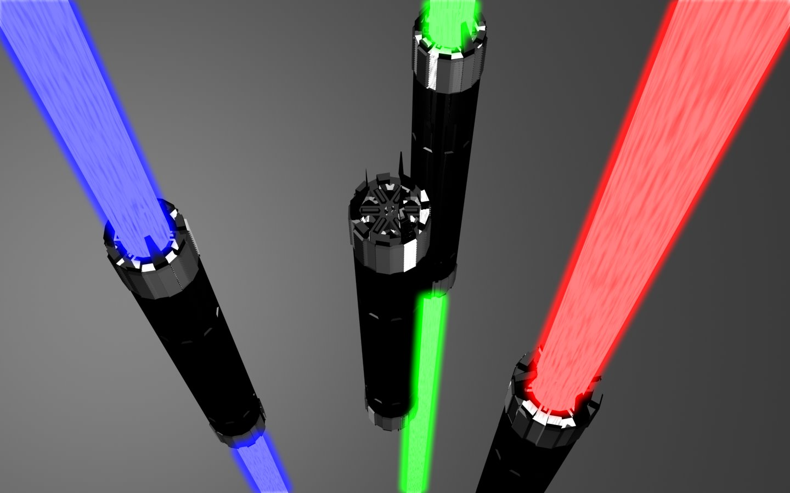
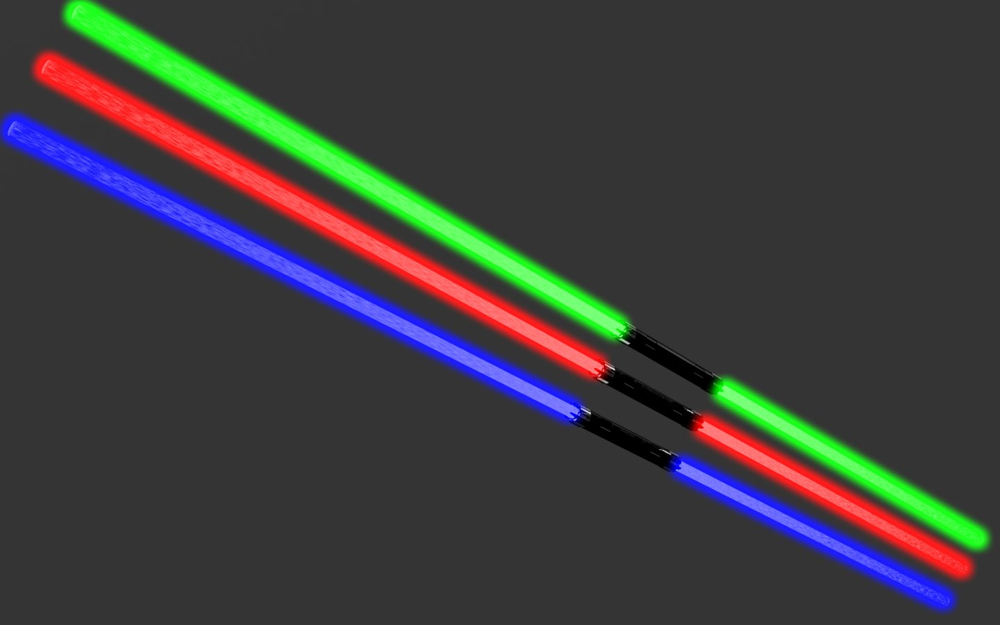
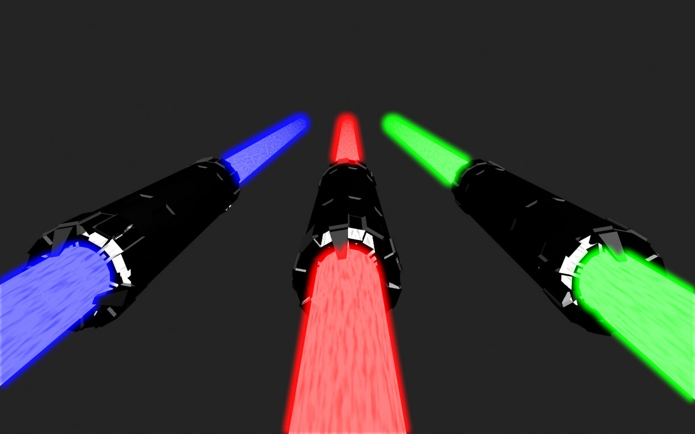
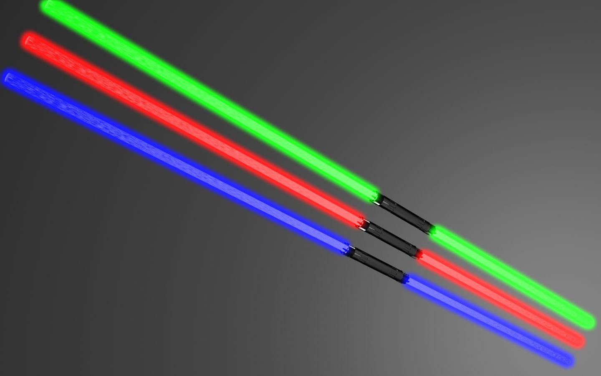
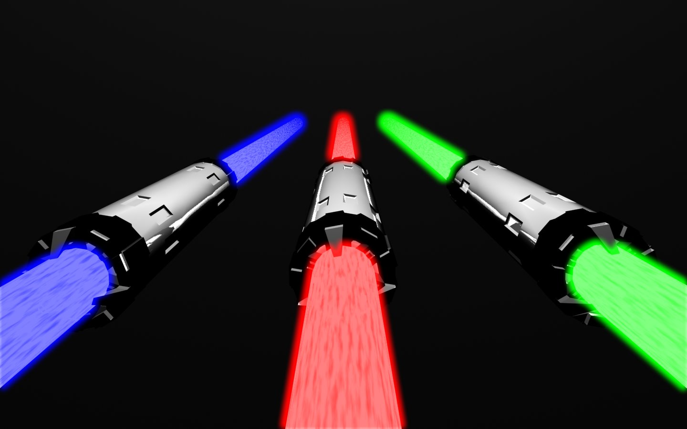
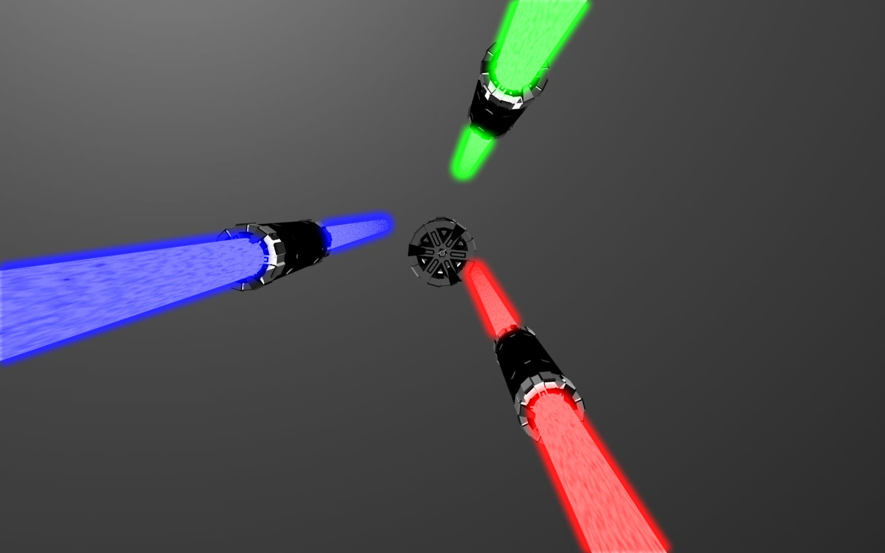

呃...最近沒梗了所以就再翻舊梗，光束棍:D

  

棍柄部分有特別花時間雕刻就是了～:P

\==

  

其實和光束劍根本同樣道理XD

  

好看就好:D

  
  

  
呵呵背景換個深淺再Render一次，不過好像沒差多少...Orz

  
  

  

下面兩張我把棍柄拿一支出來，比較清楚看到棍柄本身

  

  

\==

  

呃啊哈哈如果誰有什麼比較有趣的梗再提供給我吧xD
