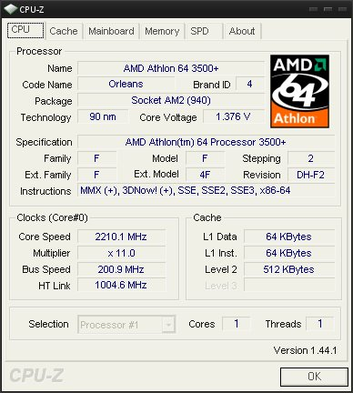

> Edit (2019-03-18): Due to image host service issue, some images in this post were lost.

  
  
這張圖是AMD Athlon64 LE 1620的CPU-Z資料圖  
  
\==  
  
想換CPU了  
  
可是不想換雙核心  
  
現在的作業系統、程式、遊戲等等都還沒有辦法完全利用多核心  
  
而多核心處理器如果沒有完全利用  
  
其效能甚至會比單核心還要弱  
  
\==  
  
這麼說吧  
  
為什麼會有雙核心的出現？  
  
記得當初處理器  
  
從很早很早的MHz時代到現在的GHz時代  
  
一直到現在處理器的時脈發展遇到了瓶頸  
  
可以說是已經到了一種極限了  
  
但生意還是要做  
  
聰明的商人把舊的處理器把他裝在一起  
  
告訴你說 我這是顆劃世代的多核心處理器喔  
  
\==  
  
這麼來看吧  
  
單核心處理器從一開始一路上揚發展到極致  
  
到最後走投無路了開始回頭拿低時脈的處理器發展雙核心  
  
接下來雙核心又達到了極致  
  
很快的四核心、十六核心就來接手  
  
如此才有賣點  
  
\==  
  
我不是否定多核心的技術  
  
我相信能把好幾顆處理器塞成一顆一定也要有點技術  
  
而且多顆核心加起來跑一定也比較快  
  
現在重點是在軟體 真的有多顆核心在跑嗎？  
  
\==  
  
處理器已經多核心了  
  
那我們的軟體呢？  
  
當初軟體設計時  
  
那時並沒有多核心處理器  
  
因此程式很自然的是適用於單核心  
  
現在掛到多核心電腦上跑  
  
因此也只用到多核心處理器其中的一部份而已  
  
剛剛說過 多核心處理器如果單看其中的一個核心的話  
  
那單個核心是不會比單核心處理器強的  
  
因此目前絕大多數的軟體沒辦法讓多核心處理器發揮極致的效能！  
  
\==  
  
「軟體都推新版本出來了，新版本有支持多核心吧！」  
  
打破新版本的軟體支持新硬體的迷思吧  
  
誰說新版本的軟體一定支持新硬體？  
  
我拿遊戲軟體做說明好了  
  
大家都知道 遊戲軟體有自己所謂的遊戲引擎  
  
用來執行這整個遊戲的  
  
通常遊戲在推出新一代的時候  
  
並不會對遊戲引擎做大幅度的修改  
  
為什麼？因為遊戲引擎很難寫呀！  
  
要撰寫新的遊戲引擎 會遠比修改遊戲資料還要麻煩  
  
修改引擎那種工程是非常浩大的  
  
沒有必要的話通常不會這麼做  
  
所以啦 話說回來  
  
核心沒修改 怎麼適應新硬體？  
  
這樣不能發揮多核心的極致效能的！  
  
\==  
  
扯了好遠好遠XD  
  
該說回來了～ 我想換處理器～～XD  
  
  
這張圖是我現在電腦的CPU-Z資料  
  
跟剛剛上面的LE1620比較起來的確差頗多  
  
在L2 Cache、Multiplier、Revision、Stepping上有顯著的差異  
  
重點是LE系列耗電量低  
  
從Core Voltage看得出其差異  
  
而且價錢頗便宜！不到兩千即可入手！  
  
[PCDVD數位科技討論區](http://www.pcdvd.com.tw/showthread.php?t=770445&page=1&pp=10) 有對LE1640做評論  
  
\==  
  
想換LE 1640  
  
不過好像貨不多吼XD
