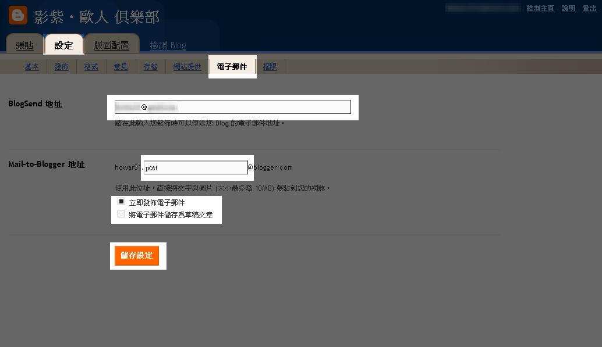

[  
  
發文章一定要上部落格？  
  
不用！善用Blogger所提供的電子郵件發文  
  
即可透過E-mail的方式發佈新文章！  
  
\==  
  
要怎麼設定呢？  
  
如圖所示 在導覽列點選「自訂」後進入後台控制畫面  
  
選擇「設定->電子郵件」  
  
其中「BlogSend地址」是指您要從哪個信箱發佈文章  
  
Blogger會認定這個信箱  
  
只有這個信箱寄來的信才會被發佈  
  
「Mail-to-Blogger地址」則是要寄到的地址  
  
從「BlogSend地址」把信寄到「Mail-to-Blogger地址」  
  
就可以發佈新文章囉！  
  
下面兩個選項決定是否要把寄出的信立刻貼在Blogger上  
  
最後記得點選「儲存設定」就完成了！^^  
  
\==  
  
祝大家使用順利！:D
