Slack 是一款團隊通訊平台服務，豐富且高度自訂的功能，提供團隊一個方便、跨平台且多元整合管理的一個溝通管道，Slack 在國外十分熱門，許多企業公司都使用這個平台來做內部溝通，但在台灣很多企業還是習慣傳統的手機、簡訊、 Email ，或是頂多用 Line 、 Facebook 等，這些平台不是不好，只是因為他們是針對休閒社交設計，對於企業需求例如權限管理、訊息保存、共享分工等都不是很方便。

Slack 不但基本功能都免費，且提供完整方便的團隊溝通工具，甚至連美國太空總署 (NASA) 的噴射推進實驗室 (Jet Propulsion Laboratory) 都採用 Slack 進行團隊溝通，證明了 Slack 提供的工具與功能足以協助大型團隊進行互動。

到底 Slack 有什麼樣的功能？為何他比其他傳統社群軟體更適合工作團隊使用？本篇將針對 Slack 做基本介紹，並提供簡單功能教學讓剛加入的朋友可以快速上手。

# Slack 簡介

Slack 著重於團隊任務溝通，包含許多方便的工具與特色。

> **Slack** 官方網站: [http://slack.com/](http://slack.com/) 下載網址: [https://slack.com/apps](https://slack.com/apps)

Slack 在多種系統上都有對應的程式可用，甚至也有網頁介面，在任何地方都可輕鬆存取，可以依照需求免費安裝或使用對應介面:

- 電腦版
    - Windows
    - Mac
    - Linux (Beta)
- 手機版
    - Android
    - iOS
    - Windows Phone (Beta)
- 網頁版

Slack 的架構與傳統一般即時通訊軟體略有不同，他並沒有一個「主帳號」的概念，而是每個平台都有自己獨立的空間，使用者加入一個平台則可在該平台內註冊身份，因此在參與不同團體的 Slack 時都可以有獨立的身份設定等等，不會互相干擾或共用。

每個團隊可以到 Slack 上註冊自己的專屬平台，然後就可以取得團隊專屬的 Slack 網址，所有使用者可以在平台上註冊該平台的帳號密碼，設定該平台專用的名稱、圖片與個人資料，甚至每個平台的設定等等都是獨立分開的。

## 加入 Slack

使用者想加入某個團隊的 Slack ，共有兩種方式:

1. 由管理員經由 Email 邀請
2. 管理員設定特定網域 Email 可直接註冊

必需要由團隊管理員邀請後才能加入 Slack 平台。Slack 以 Email 為身份辨識，收到邀請的 Email 即可在該團隊的 Slack 進行註冊與設定。

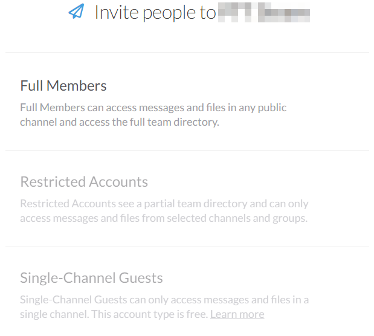

管理員邀請成員有三種模式:

- Full Members 一般會員
    - 這是一般的會員，可以正常存取所有頻道、檔案與團隊通訊錄
- Restricted Accounts 限制會員
    - 受限制的會員帳號，只能存取管理員指定的資源
- Single-Channel Guests 單頻道客座會員
    - 只能進入單一指定頻道的受限制會員

這些權限設定之後管理員可以在會員管理裡面更改。

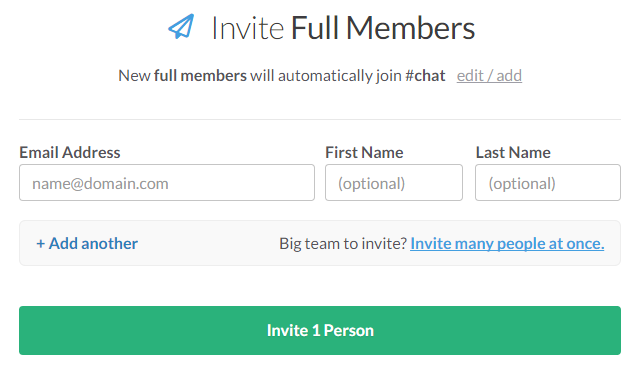

管理員輸入受邀者的 Email 之後，即可將其邀請入團隊。這裡管理員可以順便設定該使用者的姓名，或是留白讓使用者之後自行設定。此外也可以一次邀請多個 Email ，方便大量邀請。

受邀請的使用者會收到一封 Email :

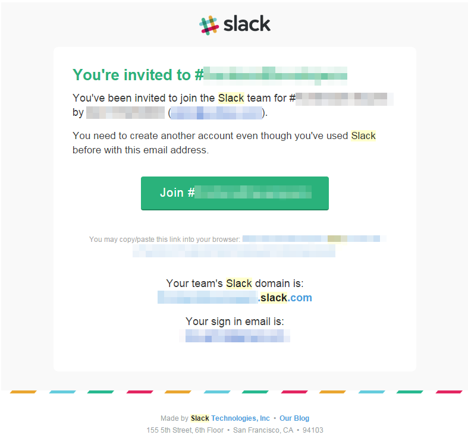

點選信中「Join」按鈕，即可開始註冊帳號。(每個平台帳號獨立，即使之前這個 Email 在其他 Slack 註冊過，仍需要重新註冊此平台專用的帳號資料)

## 基本功能與特色介紹

Slack 有許多功能，可以讓團隊根據不同的需求，建立專屬的溝通平台，使用者方面也有很多便利的功能，以下將分類介紹常用的功能！

### 頻道與群組選擇

Slack 的溝通系統有頻道 (Channel) 、個人訊息 (Direct Message) 和私人群組 (Private Group) 三種類型，可以在選單內看到列表。

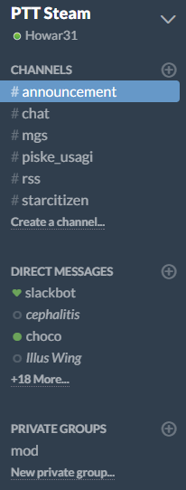

#### Channels - 頻道

與 IRC 等等一般的聊天室一樣， Channels 是公開的聊天頻道，所有人都可以自由預覽、加入與聊天。

頻道可以設定聊天室主題、頻道宗旨等等相關設定，

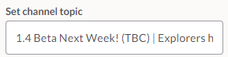

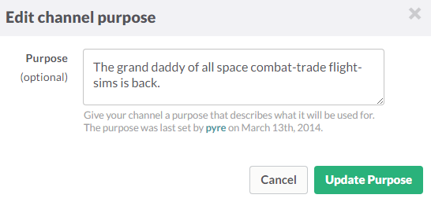

聊天室主題會顯示在最上方聊天頻道名稱旁邊，而聊天室主題是顯示在頻道列表中，用於描述頻道用途與說明。

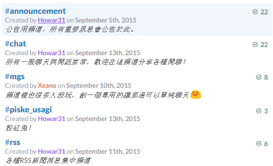

頻道的創立、封存與刪除，則要看管理員的權限設定。

#### Direct Messages - 個人訊息

一對一的聊天系統，與傳統的即時通訊類似，使用者對使用者之間的聊天，所有訊息和分享的檔案都只有兩人能看到。

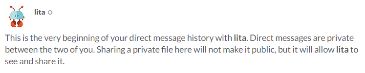

#### Private Groups - 私人群組

與頻道類似，但為隱藏的私人聊天室，私人群組不會顯示成列表，沒有邀請的使用者甚至不會知道平台上有這些群組，只有被邀請的人才能看到，其餘功能皆與頻道相同。

私人群組的創立、封存、刪除、踢人等管理，也是看團隊管理原是否有開放權限。

### 聊天對談

在 Slack 中的聊天系統，除了一般的聊天以外，還有一些很方便的功能和工具，可以協助團隊進行有效率的溝通，以及提供團隊平台客製化與管理。

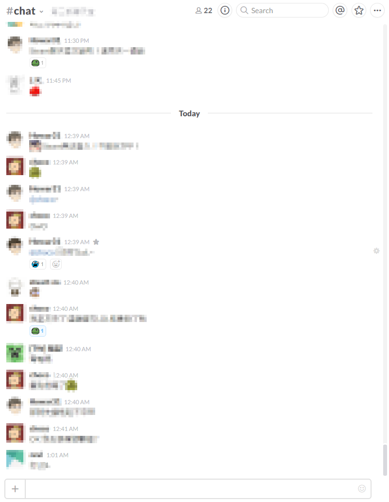

#### 「@ID」標記 和 「#頻道」標記

在聊天中若要提及某個人或是某個頻道，常常會有混淆或是不明顯的問題，例如有 ID 相似的兩個人容易搞混，或是他們沒有注意到聊天室正提到他們，甚至新加入的朋友找不到提及的頻道是哪個。

只要在聊天中使用「@」再加上使用者 ID ，即可標記使用者，被標記的使用者會自動產生超連結，所有人都可以點選該 ID 檢視使用者詳細資料，而被標記的人也會收到通知，並且在聊天文字中高亮顯示。

 

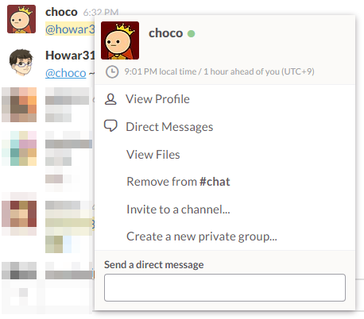

而頻道也是相同道理，使用「#」標記頻道，然後就會自動產生超連結，點選該連結就會自動切換到該頻道，十分方便。

#### 網址預覽

在聊天中輸入網址，Slack 可以自動展開預覽，一般網頁可顯示摘要片段，而圖片或影片網址可直接顯示，並在聊天視窗中直接觀看。

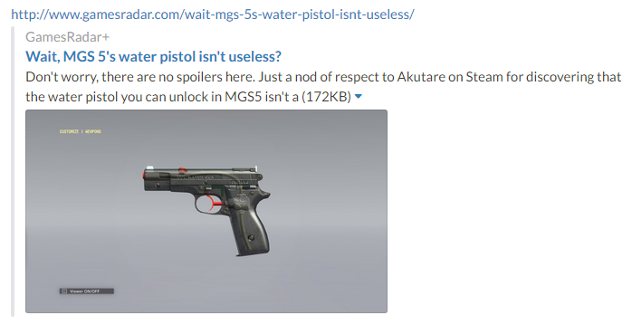

 

#### 檔案分享

除了傳統即時通訊軟體一般，可傳送圖片和影片，Slack 還可分享任何格式的檔案。

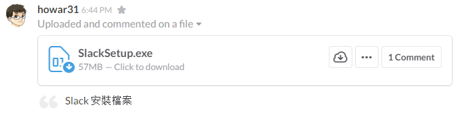

分享的圖片、影片或其他任何檔案，都可以在下面留言，讓討論可以集中，之後察看也比較清楚。、

此外 Slack 可以將頻道上分享的檔案產生公開用的分享網址，讓聊天室以外的人也可以存取檔案，當使用完畢後，也可以手動註銷公開網址。(團隊管理員可關閉此功能)

#### 「星號 (star)」和「釘選 (pin)」

這兩個功能屬於書籤功能，可以將重要或有興趣的內容做紀錄儲存，日後需要查找的時候就很方便。

「**星號 (star)**」是個人書籤，使用星號標記自己有興趣的聊天訊息，可以方便以後查閱。

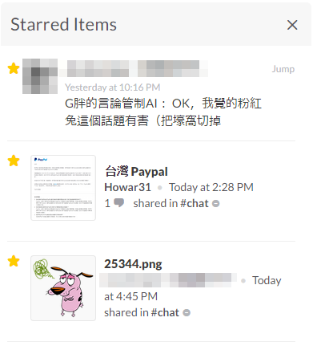

「**釘選 (pin)**」為頻道公用的置頂功能，將重要訊息加入頻道的資訊欄位，該頻道內所有人都可以看見。

#### 搜尋引擎

Slack 內建十分強大的搜尋引擎，可以搜尋所有聊天紀錄、檔案、成員等等各種資料，並且搭配參數 (modifier) 可以更精確的查找。

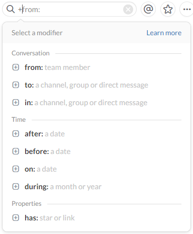

 

#### 自訂表情符號

表情符號是聊天室不可或缺的功能， Slack 內建豐富的表情符號，並且可以切換各種風格。 (截圖為 Google Hangouts 風格)

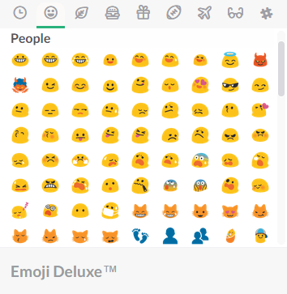

除了內建的表情符號， Slack 更支援自訂表情符號，團隊可以自行定義需要的表情符號，達到更高度客製化的溝通平台！

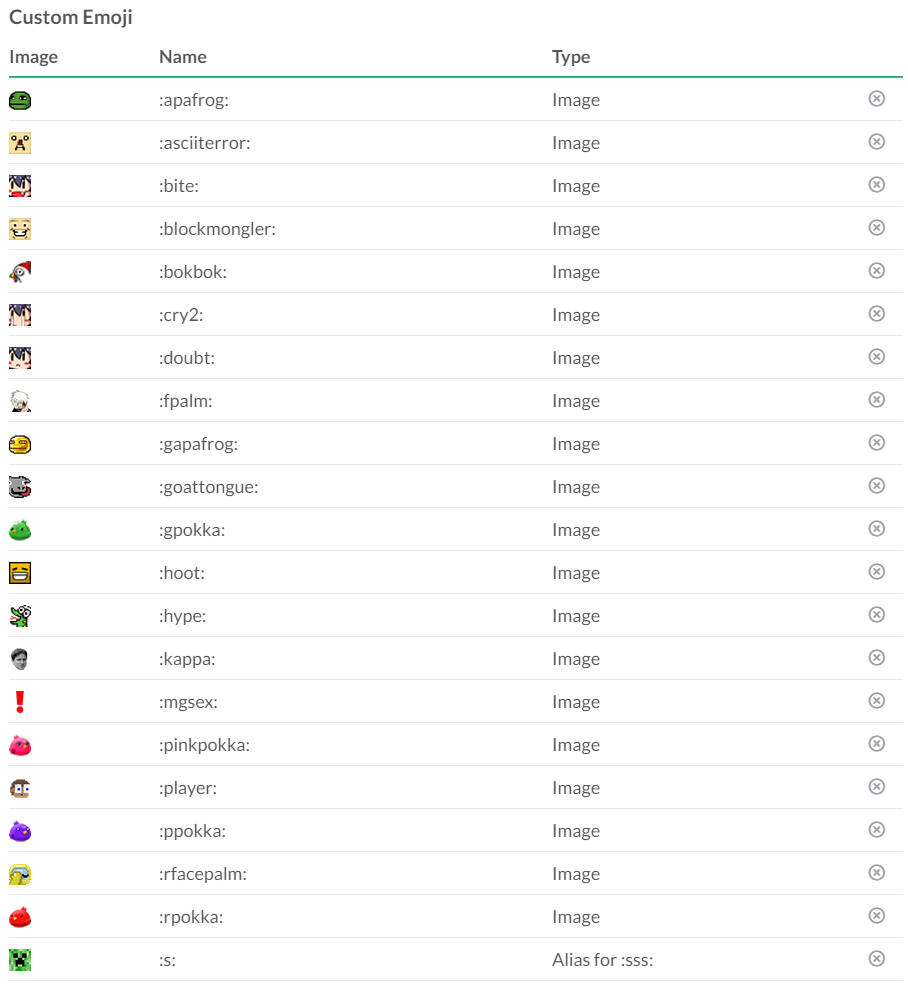

#### 可針對留言做表情回應 (react)

表情符號除了在聊天內使用以外，也可以用來針對聊天內容作表情回應。可指定訊息然後選擇表情做回應，除了不會因單行表情佔用聊天版面，也方便統計表情數量，可作為討論事項投票用等等。

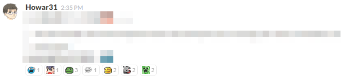

團隊管理員可以設定權限，決定是否開放讓所有人都能新增或修改團隊的自訂表情。

#### 修改和刪除

在團隊討論時，常常會有輸入錯誤的問題， Slack 支援訊息修改與刪除。

修改過的訊息會加上小註記註明這是改過的訊息。

 

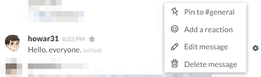

 

刪除訊息會有提醒視窗，確認是否要刪除。

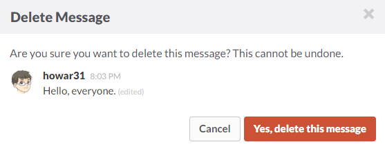

Slack 預設是所有人都能修改和刪除自己的訊息，團隊管理員可以修改權限，限制只有管理員能修改和刪除，也可以設定只有在訊息發佈後的一段時間內才能修改。

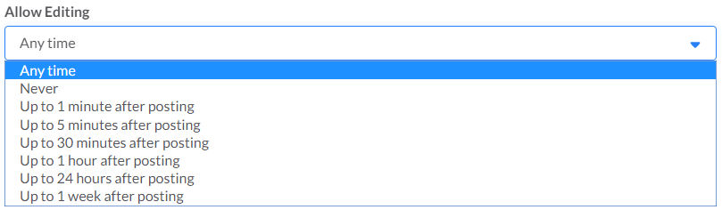

### 快速鍵

Slack 同時提供許多快速鍵，方便在操作的時候可以更流暢的使用，詳細快速鍵可以在 [官方網站文件](https://slack.zendesk.com/hc/en-us/articles/201374536-Slack-keyboard-shortcuts) 上找到，這邊僅列出部分常用的。

Ctrl /

顯示快捷鍵清單

Ctrl K

快速切換頻道或私人訊息

Alt ↑/↓

列表中上/下一個頻道或私人訊息

Alt ←/→

依照瀏覽記錄，上/下一個頻道或私人訊息

Ctrl .

展開頻道資訊側欄

Ctrl Shift E

展開團隊通訊錄

Ctrl 數字

多個團隊間切換

Esc

所有訊息設定為已讀

Alt 左鍵點選

設定最後未讀位置

↑

快速修改最後訊息

PgUp/PgDn Home/End

捲動聊天視窗

Tab

重複最近一次的指令

@ Tab

展開人名標記

\# Tab

展開頻道標記

: Tab

展開表情符號選單

Shift Enter

聊天換行

Ctrl Shift \\

針對最後一個留言開啟表情回應 (react)

# 總結

Slack 平台提供團隊一個可高度自訂且方便又有系統的溝通平台，因此國外許多企業都喜歡使用，但因為 Slack 目前尚未有中文版介面，因此在中文地區還不盛行，但這類的軟體使用的英文詞彙都很簡單，如果可以接受的話不妨嘗試看看這個強大的團隊溝通平台！
