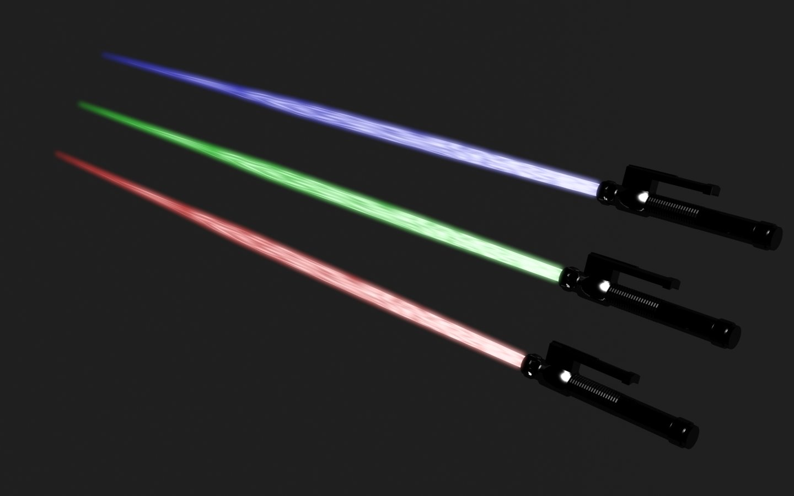
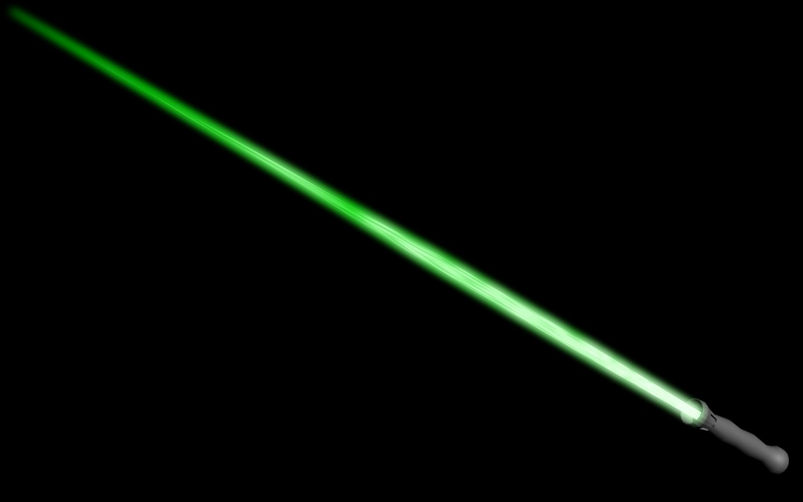
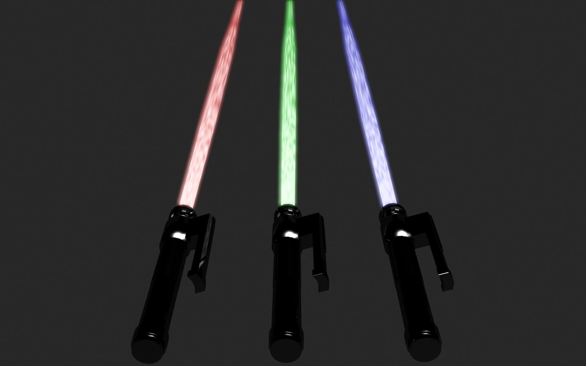
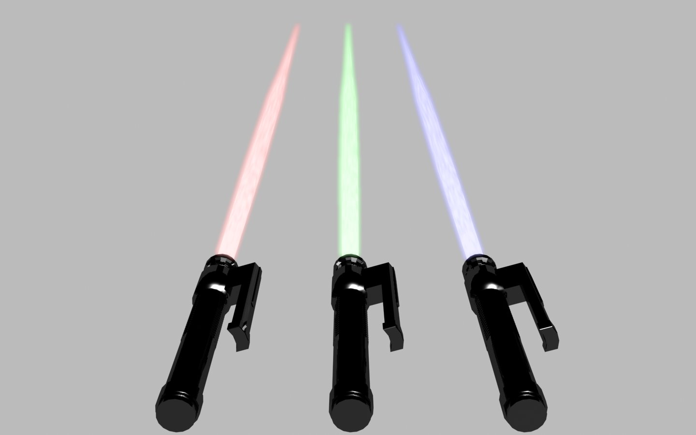
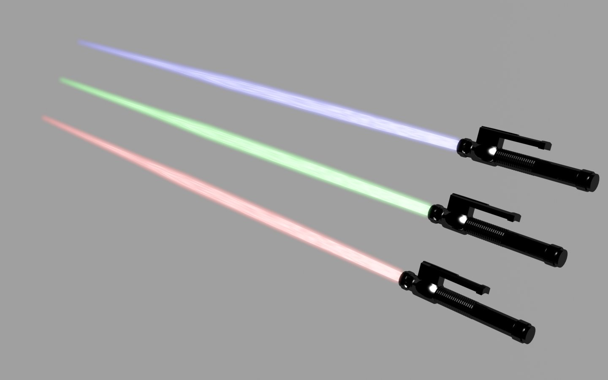
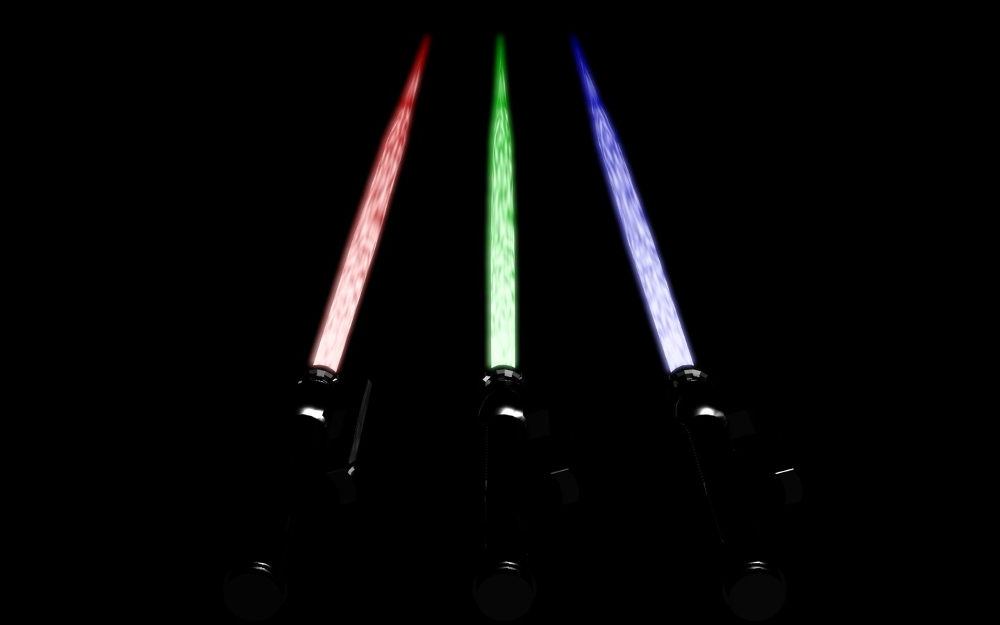
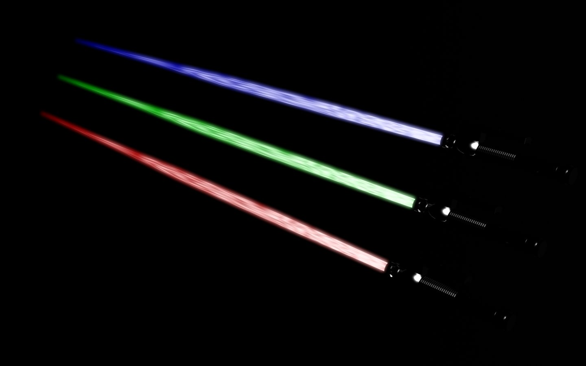

  

光束劍，上次做RX-78-2時沒有做光束劍

  

剛好光束的部分我也不太會做光暈效果，所以上網查了資料試做一次

\==

  

光暈效果我找到兩種教學，我只採用了其中一種

  

因為另一種的Render設定太麻煩，而兩種效果差不多

  

所以我就選了方便Render的方法

  

這支是第一支做出來的光束劍

  

主要在嘗試光束的作法，所以劍柄的地方就隨便了一點

  

光束研究好了，接著就把劍柄做出來

  

並且做了三個顏色，然後配上背景

  

  
  

我發現背景顏色的深淺會影響到光束的清晰度

  

深色的背景光束很清楚，但是金屬的劍柄就看不到了囧rz

  

\==

  

目前這光束劍感覺還可以，不過總覺得好像還有地方可以加強

  

若研究出新的製作方法那再分享給大家囉:D
