<style>
.vp-image-modal-card { max-width: 96vw; }
.vp-image-modal-img { max-height: 92vh; }
</style>

Claude Code 提供四種讓單一對話變成平行作業的做法：subagents、git worktrees、workflows、agent teams。一邊修 bug、一邊開發新功能、一邊查資料，這類「同時做好幾件事」的需求都可以靠它們達成。

四個名字相近、容易混淆。本文從「為什麼需要它們」開始，逐一說明：各是什麼、差在哪、怎麼用、花多少 token、什麼情況適用哪一個。

## 1. 先搞懂：為什麼一個 AI 不夠用

要理解這四種手段，得先知道它們在解決什麼問題。

一個正在運作的 Claude 對話，本質上是「一個大腦 + 一個記憶體」。這個記憶體叫做 **context window（對話視窗）**，它裝著到目前為止的所有對話：使用者的輸入、它讀過的檔案、執行過的指令輸出。它有兩個天生的限制：

- **容量有限**：塞太多東西進去（例如一次讀進好幾萬行 log），會把記憶體填滿，或開始遺漏前面的內容。
- **一次只做一件事**：同一個對話視窗裡，它是一步接一步地做，沒辦法真的「分身」。

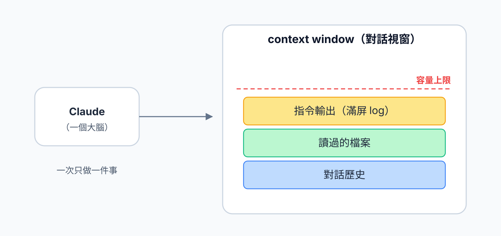

這四種平行手段，全部都是在處理這兩個限制 —— 差別只在於它們用什麼方式「分身」、彼此之間怎麼隔離、又怎麼協調。

## 2. 四個角色，一張圖先看懂

以下先用一張全景圖概覽。這四種手段可以用兩個問題來區分：

1. **會不會開出獨立的「檔案工作區」？**（也就是各自一份檔案、互不干擾地改）
2. **會不會開出獨立的「對話視窗」？**（也就是各自一份記憶體）

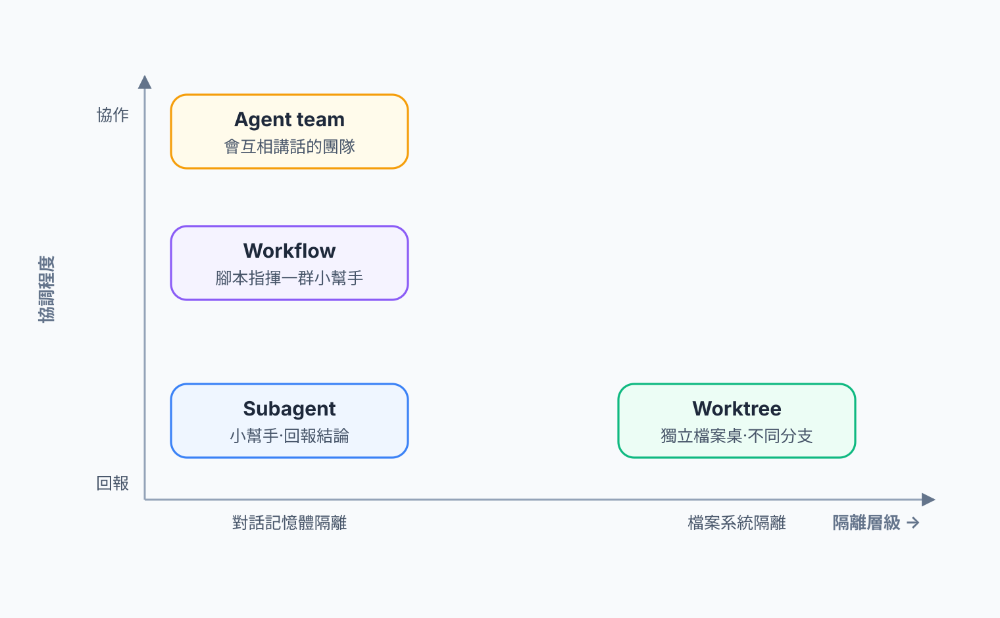

用一句話分別概括：

- **Subagent（小幫手）**：派一個助手去辦一件事，它在自己的房間做完，只把**結論**交回來。
- **Worktree（獨立工作桌）**：在同一個專案上，給每個人一張**獨立的桌子**，各自在自己的分支上改檔案、互不干擾。
- **Workflow（自動生產線）**：一段**事先寫好的流程腳本**，由程式自動指揮一群小幫手照表操課。
- **Agent team（團隊）**：一群**會互相講話**的完整 AI，共用一張任務清單，自己分工協作。

前兩個是 Claude Code 的**正式功能**，新手最先會用到；後兩個比較進階，其中 agent team 目前還是**實驗性功能**（後面會詳述）。接下來一個一個拆開講。

## 3. Subagents — 派一個小幫手去辦事

### 3.1 它是什麼

Subagent 是在**同一個對話**裡臨時派出去的一個助手。交給它一個明確的任務（「查這份文件講了什麼」「review 這個檔案」「跑測試看結果」），它會在**自己獨立的對話視窗**裡把事情做完，然後只把一份**摘要**交回主對話。

關鍵在「獨立的對話視窗」這六個字：小幫手做事過程中讀的那一大堆檔案、跑出來的大量 log、試錯過程，全部留在**它自己的**記憶體裡，**不會**灌進主對話。

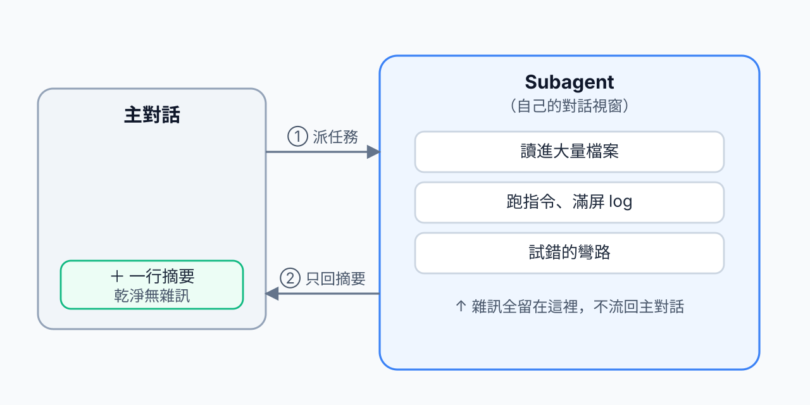

### 3.2 為什麼這樣省事又省錢

舉例：要 Claude「跑完整套測試，回報哪裡失敗」。測試輸出可能有幾千行。若直接在主對話跑，這幾千行會全部進入對話視窗，佔掉大量記憶體，而且之後每一輪對話都會帶著這堆內容重算。

改用 subagent：那幾千行留在小幫手的房間裡，主對話只收到一句「3 個測試失敗，分別是 X、Y、Z」。

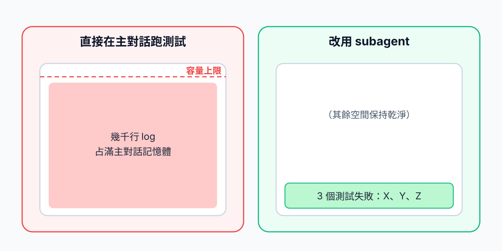

這就是 subagent 最核心的價值：**把雜訊隔離在外，主對話保持乾淨**。

### 3.3 怎麼用

最簡單的方式就是直接講：

> 「派一個 subagent 去讀 `docs/` 底下所有檔案，整理出這個專案的架構，回報給我。」

Claude Code 也內建幾種專門的 subagent 類型（例如負責大範圍搜尋的探索型、負責規劃的架構型），可指定使用哪一種。也可以**一次派出多個** subagent，平行處理彼此沒有相依關係的事 —— 例如三個小幫手同時各讀一個子系統。


subagent 可以理解為「外包一件有明確產出的小任務」：只在乎它**交回來的結論**，不在乎它過程中翻了多少資料。凡是「會產生大量看完即丟的輸出」的工作，都適合交給 subagent。


## 4. Worktrees — 給每個人一張獨立工作桌

### 4.1 先補一點 git 觀念

理解 worktree 之前，得先有一個 git 的基本概念。一個 git 專案（repo）裡可以有很多條**分支（branch）**，例如穩定的 `main` 與開發中的 `feature-x`。一般情況下，專案資料夾「同一時間只能停在一條分支上」 —— 切到 `feature-x`，資料夾裡的檔案就變成 `feature-x` 的內容；切回 `main` 又變回去。

問題在於：若要**同時**在 `main` 上修一個急件、又在 `feature-x` 上開發新功能，反覆來回切分支並不方便，而且尚未存檔的改動會擋住切換。

### 4.2 worktree 解決什麼

**Git worktree** 的作法是：同一個 repo（同一份版本歷史），在硬碟上開出**多個各自獨立的工作資料夾**，每個資料夾停在不同分支。可以在 A 資料夾改 `main`、同時在 B 資料夾改 `feature-x`，兩邊的檔案完全分開，互不覆蓋。

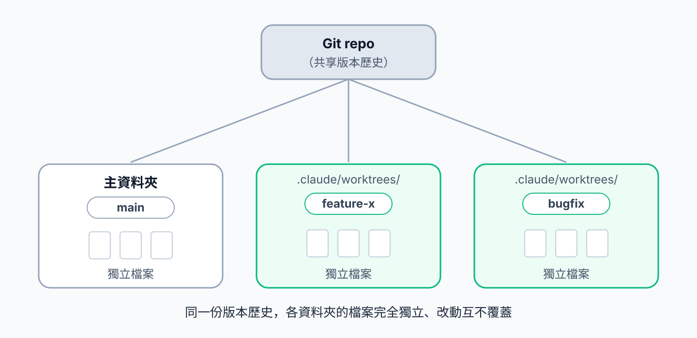

這是一種**檔案層級**的隔離。它和 subagent 的差別在於：subagent 隔離的是「對話記憶體」，worktree 隔離的是「硬碟上的檔案」，兩者不同。

Claude Code 已將這件事封裝好。啟動時加上 `--worktree`，它會自動開一個 worktree（放在專案的 `.claude/worktrees/` 底下）並在裡面工作。已經在跑的對話，也可以中途用 `EnterWorktree` 切進一個新的 worktree，原本資料夾的檔案完全不動；再用 `ExitWorktree` 切回來。

### 4.3 容易誤會的點：新 worktree 的來源分支

這是新手最容易誤會的地方。當 Claude Code 開一個新的 worktree，裡面的內容基於哪條分支？答案由設定 `worktree.baseRef` 決定：

- **預設 `"fresh"`**：新 worktree 從**遠端的預設分支**（通常是 `origin/main`）切出來，是一份**乾淨的副本**。
- **設成 `"head"`**：從**目前所在的分支**切出來。

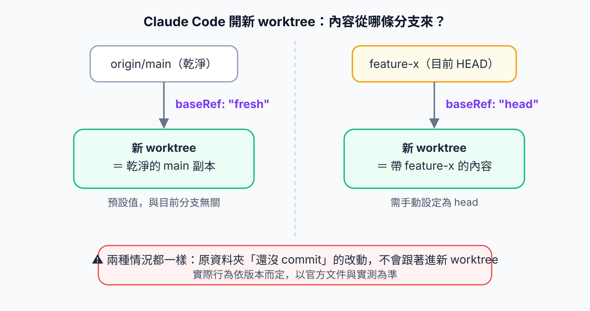

舉一個實際情境：假設某個 AI 已經在主資料夾切到 `feature-x` 工作一陣子，此時要另開一個工作區做**全新、獨立**的功能。在預設的 `"fresh"` 之下，新 worktree 會是乾淨的 `origin/main`，**完全不受** `feature-x` 進行中的工作影響 —— 這通常正是需要的結果：兩條線各做各的，互不干擾。

但有兩個前提不論哪種設定都成立：


**未存檔的改動不會一起帶過去。** 新 worktree 拿到的是某個 commit 的乾淨檢出；原資料夾尚未 commit 的修改只會留在原資料夾。此外，被 `.gitignore` 忽略但實際存在的檔案（例如 `.env`）也不會自動複製，需要用 `.worktreeinclude` 指定要帶入的檔案。

另外，`baseRef` 的實際行為在不同版本間有過變動，也有已知的回報問題。**請以當前版本的官方文件與實測為準**，不要假設固定是哪條分支。



worktree 適合「同時在同一專案的**不同分支**上各做各的事」。若只是要外包一件小任務、不需要動到另一條分支，用 subagent 即可，不必開 worktree。


## 5. Workflows — 寫好的自動生產線

### 5.1 它和 subagent 到底差在哪

這是最多人混淆的地方，先用一句話講清楚：

> **Subagent 是「單次派遣」；workflow 是「把很多次派遣的順序、平行、迴圈寫成一段程式，讓系統自動照表執行」。**

一般使用 subagent 時，是 Claude **逐輪思考**：做完這步、判斷一下、再決定下一步派誰。Workflow 則是把整套流程**事先寫成一段 JavaScript 腳本** —— 「第一步同時派 10 個小幫手各掃一個檔案 → 第二步合併結果 → 第三步再派人逐項驗證」 —— 然後交給背景執行器自動跑完，只把**最終結果**交回來。

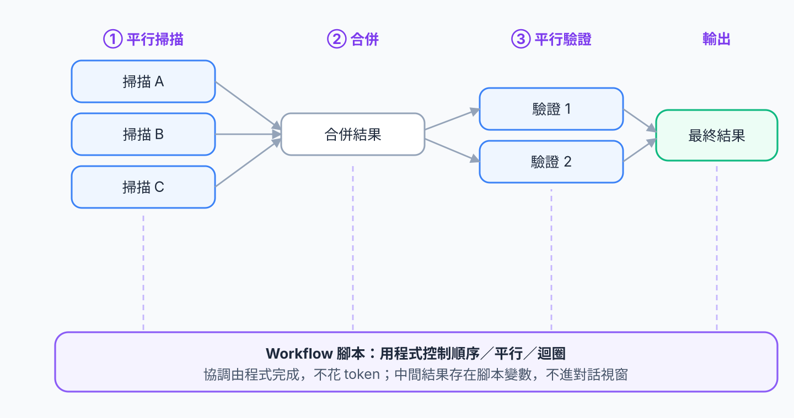

### 5.2 關鍵差異：協調是「程式」還是「對話」

這裡有一個對成本影響很大的重點。Workflow 裡「決定下一步做什麼、誰先誰後、要不要重跑」的**編排邏輯是程式碼，不是 AI 的思考**。程式做判斷不花任何 token，中間結果也是存在腳本的變數裡，不會佔用任何對話視窗。Claude 的記憶體裡只留下最後那份答案。

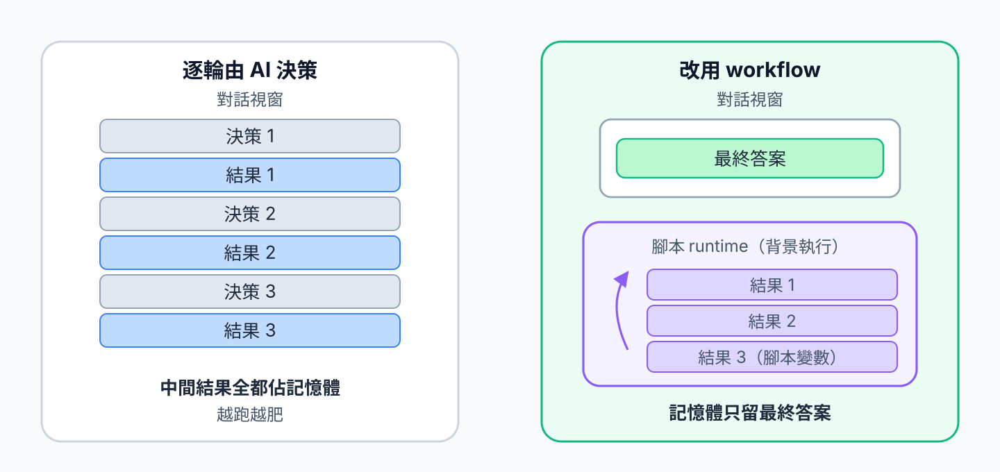

換句話說，workflow 底下用的**還是 subagents**，它只是在上面多包了一層「用程式精準控制流程」的編排。Subagent 是零件，workflow 是把零件組起來、會自動運轉的生產線。

### 5.3 怎麼用、什麼時候用

不需要自己手寫腳本 —— 用白話描述要做的事，Claude 會把 workflow 腳本寫出來並在背景執行。它特別適合**大規模、步驟固定、可重複**的工作：

- 一次稽核 500 個檔案，每個檔案派一個小幫手平行檢查。
- 跨很多來源做研究，先搜尋、再逐筆深讀、最後交叉驗證。
- 需要「先找出問題 → 再請另一批人反過來挑戰每個發現是否成立」這種有固定品管步驟的流程。


臨時要一個答案 → 用 subagent。要對「一大批對象」跑「同一套固定流程」、且日後可能重複執行 → 才值得用 workflow。初期通常用不到 workflow，知道它存在、遇到大規模重複工作時再回頭查即可。


## 6. Agent teams — 一支會互相講話的團隊

### 6.1 它是什麼

前面三個裡，subagent 和 workflow 的小幫手都是「做完一件事就回報，彼此之間不講話」。**Agent team** 不一樣：它是一群**完整、獨立**的 Claude（每個都有自己的對話視窗），其中一個當「隊長（lead）」，其餘是「隊員（teammate）」。它們透過兩個機制協作：

- **一張共享的任務清單**：所有成員都看得到任務的狀態（待辦、進行中、完成），可以自己認領下一件，任務之間還能設相依關係。
- **點對點訊息**：隊員之間可以**直接互相傳話**，不需要透過隊長轉達。

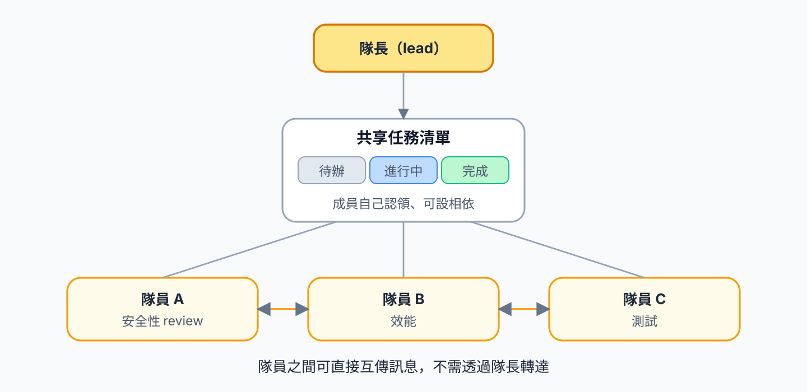

這讓它適合需要**真正討論與分工**的工作：例如三個隊員同時從「安全性」「效能」「測試」三個角度 review 同一份程式碼；或是除錯時，幾個隊員各自驗證一個假設，再互相比對找出真正的原因。

### 6.2 怎麼啟動與使用


Agent teams 目前是**實驗性功能，預設關閉**，需要 Claude Code **v2.1.32 以上**。先在設定裡開啟：

```json
// settings.json
{
  "env": { "CLAUDE_CODE_EXPERIMENTAL_AGENT_TEAMS": "1" }
}
```

實驗性功能的行為與介面可能隨版本改變，**以官方文件為準**。


開啟後，**啟動方式就是直接講**，沒有特別的指令：

> 「建一個 team，派 3 個隊員平行處理：一個負責安全性 review、一個負責效能、一個負責測試。隊員用 Sonnet。」

Claude 會自動建 team、產生隊員、分配角色、開始照共享清單工作。日常操作（單一終端機的 in-process 模式）大致是：

| 想做的事 | 操作 |
|---|---|
| 加一個隊員 | 對隊長說「再派一個隊員去做…」 |
| 看共享任務清單 | 按 `Ctrl+T` 切換 |
| 在隊員之間切換 | 按 `Shift+Down` 循環 |
| 看某個隊員的完整畫面 | 按 `Enter` |
| 中斷某個隊員 | 按 `Esc` |
| 收掉整個團隊 | 對**隊長**說「clean up the team」（要先把隊員關掉） |

想要分割畫面同時看到所有隊員工作，可以裝 tmux 或用 iTerm2，把設定 `teammateMode` 設成 `"tmux"`。

### 6.3 注意事項

Agent teams 功能完整，但有幾個實驗性階段的限制需先知道：in-process 模式的隊員**不支援** `/resume`、`/rewind` 還原；一個隊長一次只能帶一個 team；隊員**不能再開**自己的子團隊；VS Code 內建終端、Windows Terminal、Ghostty 不支援分割畫面。最重要的是它的 **token 成本最高** —— 下一節細講。

## 7. 它們到底差在哪：一張比較表

把四個放在一起對照，差異就清楚了。重點看三件事：**會不會開獨立的 git 檔案目錄、會不會開獨立的對話視窗、彼此怎麼協調**。

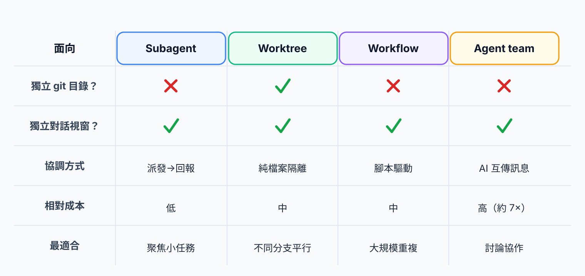

| | 開獨立 git 目錄？ | 開獨立對話視窗？ | 協調方式 | 最適合 |
|---|---|---|---|---|
| **Subagents** | 否 | 是（與主對話隔離） | 主對話派發 → 小幫手回報結論 | 聚焦、自足的小任務 |
| **Worktrees** | **是** | 是（各自獨立 session） | 無內建協調，純檔案隔離 | 在不同分支上平行作業 |
| **Workflows** | 否 | 是（它派出的 subagents） | **腳本（程式）**驅動，自動編排 | 大規模、可重複的固定流程 |
| **Agent teams** | 否 | 是（每個隊員是完整 AI） | **AI 互傳訊息** + 共享任務清單 | 需要討論協作的複雜工作 |

一句話總結：**前三個在回答「誰來做、怎麼協調」，worktree 在回答「在哪個檔案空間做」。**

## 8. 成本怎麼算：token 花費比較

平行作業實用，但並非免費。這四種手段的 token 消耗差距很大，使用前最好先掌握。

### 8.1 由便宜到貴

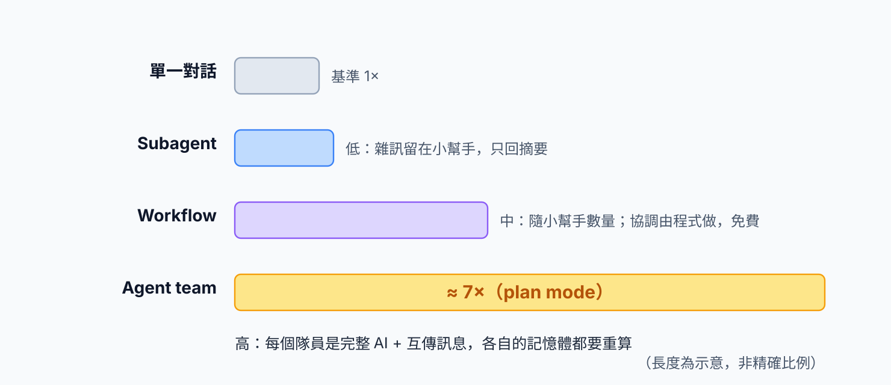

- **Subagents（最低）**：小幫手做事的雜訊全留在它自己的房間，**只有摘要回到主對話**，等於替主對話擋掉大量 token。
- **Workflows（中等，隨小幫手數量增加）**：編排邏輯是**程式，協調本身不花 token**；中間結果也不進對話視窗。成本主要是它派出去的那些 subagent 的總和。也就是說，協調是免費的，只有實際做事的小幫手在計費。
- **Agent teams（最高，約單一對話的 7 倍）**：每個隊員都是一個**完整的 Claude 實例**，各自載入自己的設定與記憶體；而且協調是靠**隊員之間互傳訊息**完成的，每一則訊息、每次認領任務都是一次 AI 思考，會把該成員的整個對話視窗再算一次。


Workflow 的「指揮」由程式執行（不計 token），agent team 的「指揮」是一群 AI 互相溝通（每一則訊息都計入 token）。因此同樣是多 AI 協作，workflow 的單位成本遠低於 agent team。官方數據：agent team 在 plan mode 下約為單一對話的 **7 倍** token。


### 8.2 「閒置的隊員仍會消耗 token」是什麼意思

官方文件明確建議「用完立刻 clean up 團隊」，理由是「閒置的隊員仍會持續消耗 token」。這句話容易被誤解為「待機就持續計費」，實際上需要更精準的說明：

AI 的計費原則是 —— **只有實際送出一次思考請求才計入 token**。真正在等待、沒有思考的隊員，當下不消耗 token。所以「閒置仍消耗」指的不是被動待機空轉，而是以下幾點：

1. **隊員會自己認領下一個任務**：做完一件事後，會主動查看任務清單、決定接下哪一件 —— 這個「查看、判斷」本身就是一次思考。看似閒置，實際上可能正在接新工作。
2. **重新喚醒的代價很高**：一個跑很久的隊員，記憶體已經很大；任何一則訊息將它喚醒，都要把整份記憶體**重算一次**。
3. **只要還存在就會被納入協調**：未收掉就可能被指派任務、被點名、被帶進新一輪討論。

所以「用完立刻收掉團隊」要避免的，不是想像中的待機耗用，而是**「只要它還存在，就會持續產生協調思考，並重算越來越大的記憶體」**。

## 9. 我該用哪一個？一張決策圖

實際使用時，有一個簡單的判斷順序：

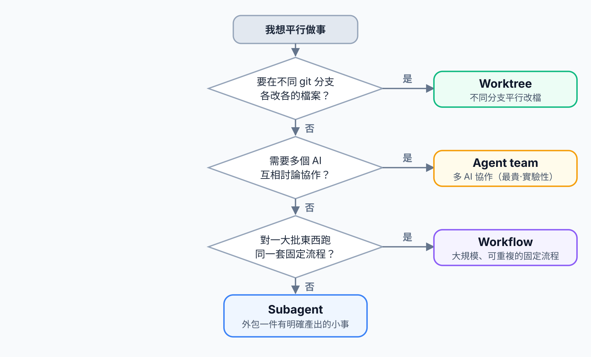

判斷的順序如下：

1. **只是想外包一件有明確產出的小事，不希望雜訊塞滿對話？** → **Subagent**。
2. **需要同時在同一專案的不同分支上各做各的事、檔案不能互相覆蓋？** → **Worktree**。
3. **需要對一大批對象跑同一套固定流程、且可能重複執行？** → **Workflow**。
4. **需要多個 AI 真正討論、互相挑戰、分工協作？** → **Agent team**（成本最高，且為實驗性）。

它們也可以**組合使用** —— 例如在 workflow 裡讓每個小幫手各自在獨立的 worktree 中工作，避免平行改檔時互相覆蓋。

## 10. 注意事項總整理

最後把容易出錯的點集中列出：

- **避免用錯工具**：順序性的工作、或只是外包一件小事，用單一對話或 subagent 最快也最省；不必動輒開 agent team。
- **改同一個檔案會互相覆蓋**：多個成員同時改同一份檔案會衝突。需要平行改檔時，搭配 worktree 做檔案隔離。
- **Agent team 是實驗性、成本最高**：預設關閉、需要 v2.1.32+、約 7 倍成本，用完務必立刻 clean up。
- **Worktree 的 baseRef 行為依版本而定**：未 commit 的改動不會帶過去、`.gitignore` 的檔案要靠 `.worktreeinclude` 帶入，實際從哪條分支切請以官方文件與實測為準。
- **版本會變動**：這些都是仍在快速演進的功能，本文為當前的整理，遇到行為不符時，**以官方最新文件為準**。

## 11. 小結與延伸閱讀

- **Subagent** = 派一個小幫手辦一件事，只收結論（最省）。
- **Worktree** = 給每條分支一張獨立工作桌（檔案隔離）。
- **Workflow** = 寫好的自動生產線，用程式免費指揮一群小幫手。
- **Agent team** = 一支會互相溝通的團隊，能力最完整、成本也最高（實驗性）。

四者解決的維度不同：前三個處理「誰做、怎麼指揮」，worktree 處理「在哪改檔」。掌握這條主線後，剩下的就是依任務性質選工具。

延伸閱讀（官方文件）：

- [Sub-agents](https://code.claude.com/docs/en/sub-agents.md)
- [Git worktrees](https://code.claude.com/docs/en/worktrees.md)
- [Workflows](https://code.claude.com/docs/en/workflows.md)
- [Agent teams](https://code.claude.com/docs/en/agent-teams.md)
- [Cost management](https://code.claude.com/docs/en/costs.md)
