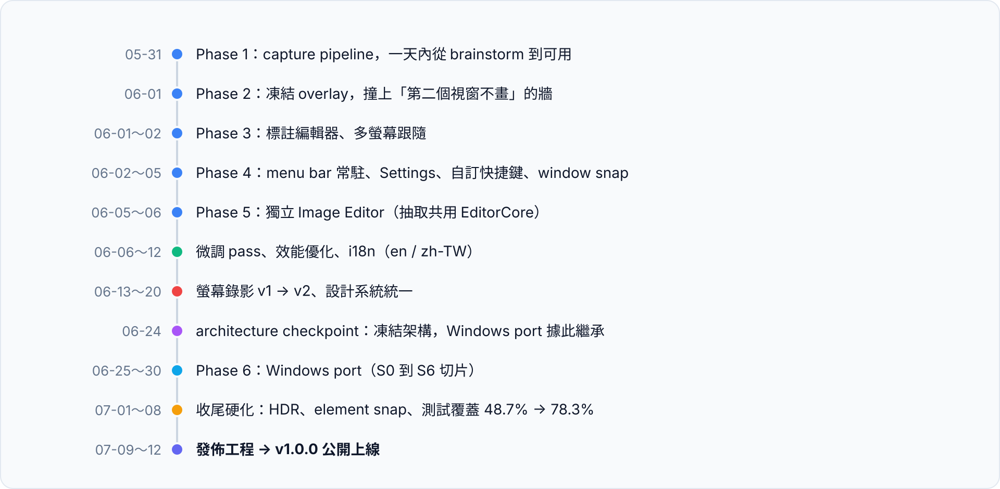
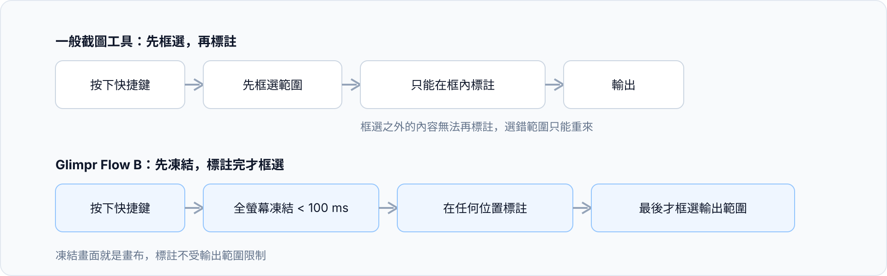
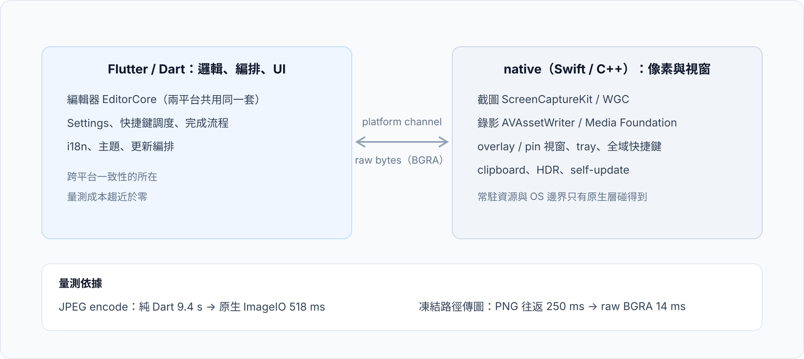
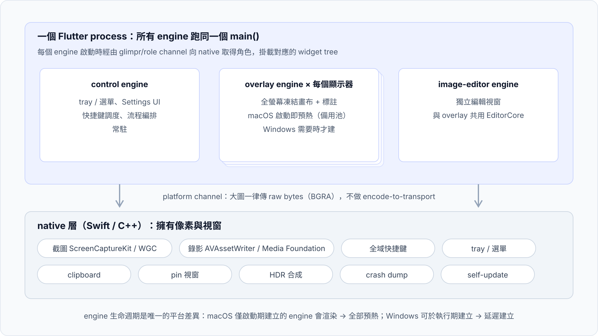
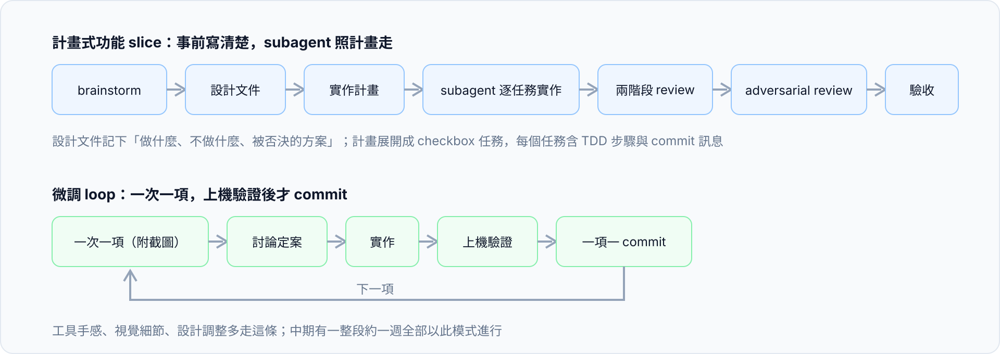
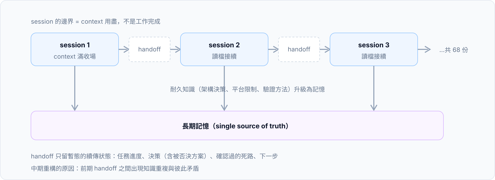
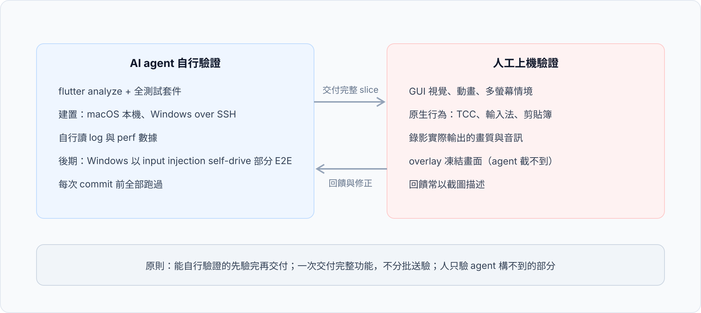
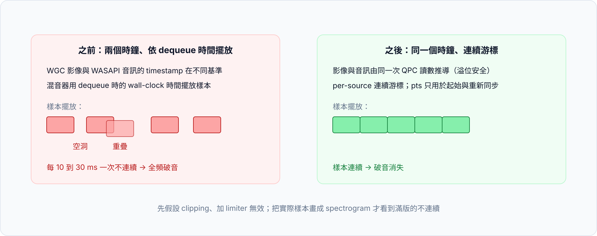
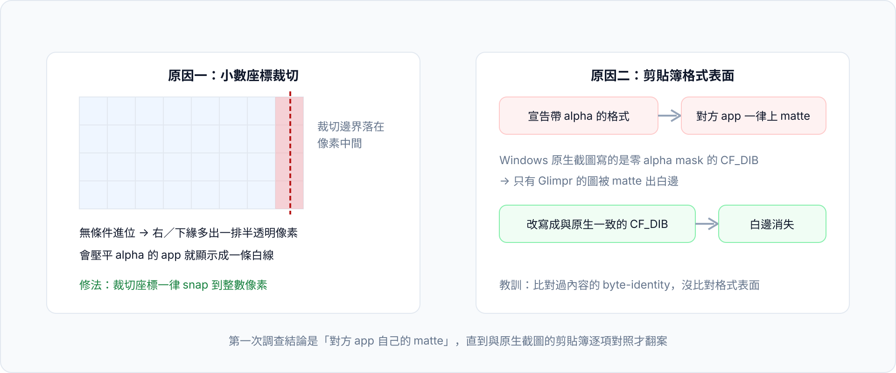
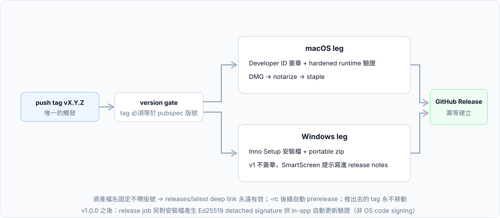

[Glimpr](https://glimpr.howar31.com) 是一個 macOS 與 Windows 的截圖、標註、螢幕錄影工具。2026 年 5 月 31 日開工，7 月 12 日以 v1.0.0 公開上線，開發期約六週，全程由我與 AI coding agent（Claude Code）協作完成，repo 在 [github.com/howar31/glimpr](https://github.com/howar31/glimpr)，Apache-2.0。

本文記錄整條路：為什麼做、技術選型、多引擎架構、開發與驗證流程、撞牆紀錄、公開前的工程紀律、上線工程，以及與 AI 協作六週後的觀察。

## 1. 為什麼做 Glimpr

起點是一個具體的症狀：原本日常使用的截圖工具，在系統開機一段時間後，按下快捷鍵要等 2 到 3 秒畫面才凍結。設計階段的分析判斷，成因是它在快捷鍵路徑上呼叫 `SCShareableContent.current` 這類昂貴的枚舉 API。Glimpr 的第一需求因此收得非常窄：**按下快捷鍵到全螢幕凍結要在 100 ms 以內，而且不隨開機時間退化**。

這條需求貫穿整個架構：凍結用的 overlay 引擎預先建好、per-display 的 capture filter 事先快取（只在顯示器變動通知時更新，永不在截圖路徑上重查）、PNG encode 移出凍結路徑。曾評估更激進的 p50 < 50 ms 目標，但那需要常駐一條 SCStream、會讓系統的錄影指示燈長亮，於是否決，最後落在冷捕約 90 ms。

互動模型也與多數工具相反，內部稱為 Flow B：**先凍結整個畫面 → 在任何位置標註 → 最後才框選要輸出的範圍**。一般工具是先框選再標註，框選之外的內容就回不去了。

v1.0.0 的功能範圍：互動截圖（region / window / display、element snap、HDR 截圖）、12 種標註工具（overlay 與獨立 image editor 共用同一套）、螢幕錄影（H.264 / HEVC / HDR10 / GIF，系統音與麥克風）、pin 釘選、可設定的完成流程、可重綁的全域快捷鍵、英文與繁體中文介面。

## 2. 技術選型：Flutter，加一層厚的 native

選型階段評估過純 Swift（macOS only）、兩套原生、Tauri、Electron，最後選 Flutter + 手寫原生層：UI 與邏輯單一 codebase，像素與視窗交給各平台原生（macOS 用 Swift，Windows 用 C++/WinRT）。

native 與 Flutter 的分工不是憑感覺，開發過程中收斂成四條規則，每條都有量測數字支撐：

| # | 規則 | 依據 |
|---|---|---|
| R1 | 邏輯、編排、UI 全在 Flutter | 量測成本趨近於零；跨平台一致性的所在 |
| R2 | 像素量大的工作走 native，不用純 Dart 套件 | Dart `image` 的 JPEG encode 要 9.4 s，ImageIO 518 ms |
| R3 | 跨 platform channel 傳大圖用 raw bytes | 凍結路徑 PNG 編解碼往返 250 ms，raw BGRA 14 ms |
| R4 | 常駐資源與 OS 邊界（tray、hotkey、權限）在 native | 生命週期與權限模型只有原生層碰得到 |

「整個 overlay 改原生重寫」也曾被正式評估過：結論是只能省下閒置記憶體（release build 實測每個備用引擎的邊際成本約 9.5 MB）、CPU 不是問題，還會賠掉「同一套編輯器跑兩個平台」的跨平台命題，於是正式關閉這個選項。這裡附帶一個量測教訓：debug build 曾量出每個引擎約 100 MB，差點導出錯誤的架構決策，從此**效能與記憶體一律量 release build**。

依賴策略是另一個特徵：capture、overlay、錄影、hotkey、tray、self-update 全部不用現成 plugin，手寫原生。過程中還把三個既有依賴換掉（`hotkey_manager` 換成 Carbon 原生實作、`pasteboard` 換成自有 clipboard channel、色彩選擇器自製）。最終 pubspec 的第三方依賴不到十個。

## 3. 多引擎架構：一個 main()，多個角色

Flutter desktop 一個 engine 掛一個視窗，而 Glimpr 需要「每個顯示器一張全螢幕凍結畫布」加上常駐的控制邏輯與獨立編輯器。做法是所有 engine 跑同一個 `main()`，啟動時透過 `glimpr/role` channel 向 native 詢問自己的角色（`control`、`overlay`、`image-editor`），再掛載對應的 widget tree。

engine 生命週期是兩個平台唯一被允許不同的地方：macOS 的 Flutter engine 只有在 app 啟動期建立才會取得 render loop，啟動後建立的 engine 會執行 Dart 但永遠不繪製（on-device 驗證，詳見撞牆紀錄）；Windows 沒有這個限制，執行期建立引擎經 spike 證實可穩定 60 fps 渲染。因此 macOS 在啟動時預熱全部引擎並保留備用池應付顯示器熱插拔，Windows 則需要時才建。這條差異寫成一份 engine lifecycle 契約文件，其餘程式碼不感知平台。

## 4. 開發流程：兩種模式，加上 session 之間的接力

整個專案的開發節奏與先前 [slk](/posts/slk-slack-cli-for-ai-agents/) 一脈相承，但規模大了一個檔次，實際運作收斂成兩種模式。

**計畫式功能 slice**：brainstorm 對齊方向 → 設計文件定案「做什麼、不做什麼、被否決的替代方案」 → 實作計畫展開成 checkbox 任務（每個任務含 TDD 步驟與對應的 commit 訊息）→ 每個任務派一個全新的 subagent 照計畫實作 → 兩階段 review（範圍符合、程式品質）→ 整份 diff 再做一次多視角的 adversarial review → 交付驗收。adversarial review 不是儀式，它抓到過真 bug，例如一個「重設所有樣式」要重啟才生效的狀態問題，和一個跑錯 thread 的 channel 回覆。

**微調 loop**：沒有事前 spec，我一次丟一項（通常附截圖），討論定案後實作、上機驗證、一項一 commit。工具手感、視覺細節、設計調整多走這條，中期有一整段約一週的「微調 pass」全部以這個模式進行。

Session 的邊界由 context 容量決定，不由工作進度決定，多數 session 是「工作還沒完、context 先滿了」收場。銜接靠 handoff 文件：固定章節記錄任務狀態、已做的決策（含被否決的方案與否決原因）、確認過的死路、下一步，下一個 session 讀檔接續。六週下來累積了 68 份 handoff，平均一天超過一份半，這個數字同時也是 session 更替頻率的寫照。中期做過一次接力機制的重構：把「耐久知識」（架構決策、平台限制、驗證方法）從 handoff 抽出、升級成長期記憶檔案作為 single source of truth，handoff 縮減為暫態的續傳狀態，原因是前期的 handoff 之間出現了知識重複與彼此矛盾。

平行化的用法與[之前整理的四種手段](/posts/claude-code-parallel-agents/)一致：研究型工作大量派唯讀 subagent（最大的一次技術調查一口氣用了三十多個 agent 平行處理六個面向），大型調查的結論再派另一批 agent 專門反駁；高風險宣稱在這一步被推翻的比例相當高，反方驗證的價值在這個專案被反覆證實。

設計則是外包給獨立的 design session 產出（Aurora 主題、viewfinder logo），工程側只有一條規則：設計交付物一律是 style reference，不因設計稿增減任何功能。

## 5. 驗證分工：agent 是 build oracle，人是 GUI oracle

桌面 app 與 CLI 專案最大的差別在驗證。CLI 的輸出 agent 自己讀得到；截圖工具的核心體驗（overlay 凍結、多螢幕跟隨、錄影畫質）agent 一項都構不到。六週下來的分工穩定成這個形狀：

agent 的自驗 gate 是每次 commit 前的 `flutter analyze` + 全測試套件 + 建置；log 與 perf 數據自己讀，不叫人貼。人負責 GUI 視覺、多螢幕情境、原生行為、錄影實際輸出。這條線上長出幾條規則，全部來自實際踩痛：

- **能自己驗的先驗完再交人**。早期 agent 會丟出一整張人工測試清單，其中一半是它自己就能驗的項目。
- **一次交付完整 slice**。半成品送驗會讓人搞不清楚哪些該動哪些不該動，驗證輪次直接翻倍。
- **研究型 subagent 一律唯讀**。第一天就有一個研究 agent 自作主張建了簽章憑證、重設了 TCC 權限，從此所有變更只在主對話、經確認後執行。

macOS 有一個影響整個開發迴圈的細節：Screen Recording 的 TCC 授權綁定程式簽章，`flutter run` 的簽章每次都變，授權每次都掉。解法是固定一張開發憑證、一律以 `open` 啟動 app。Windows 側則是另一套迴圈：在 Mac 上編輯、rsync 到一台 Windows 測試機、SSH 觸發建置。rsync 的時鐘偏差曾讓 Flutter 靜默跳過重建，人反覆測到舊 code，最後在同步後補一次 touch 校時才根治。後期 agent 在 Windows 上透過工作排程器做 input injection，部分 E2E 得以 self-drive。

## 6. 撞牆紀錄

六週裡真正的牆有這幾面，每面都值得單獨記錄。

### 6.1 第二個 Flutter 視窗永遠畫不出來

Phase 2 的凍結 overlay 需要在既有 app 裡開第二個 Flutter 視窗。結果視窗開了、Dart 跑了、就是一片空白：換 engine 建立時機、預先 attach、alpha 0 預熱，連換七種做法都不畫。當時的結論一度是「放棄 Flutter overlay、整個改原生重寫」。後來一輪對照 Flutter engine 原始碼（釘住實際使用的版本）的深入研究推翻了它：第一次繪製被 gate 在一次真實的 on-screen layout pass 上，修法純粹是呼叫順序：先 attach view controller、`setFrame(display: true)`、再 `makeKeyAndOrderFront`，永遠不能先藏著。一行架構都不用改。

這面牆留下的教訓被引用了整個專案：**build 過、測試綠，不代表 runtime 會畫**。

### 6.2 「啟動後建立的引擎不會渲染」連撞三次

同一條平台限制以三種面貌出現：熱插拔的新顯示器有凍結畫面但 HUD 永遠不跟過去（新 engine 收不到 render loop）；image editor 想做成隨用隨開，spike 直接失敗；最後整個 macOS 架構被它塑形。根因在 engine 層：macOS 的 Flutter engine 只在 app 啟動視窗期建立才會啟動 CVDisplayLink。解法統一為「啟動即誕生的備用引擎池」：熱插拔時把一個備用引擎用 `setFrame` 重新安置到新顯示器（display link 隨之重新註冊），editor 視窗改為啟動時建好、常駐待命。

### 6.3 截圖之後，別的 app 點不動了

Windows 上最難定位的一隻 bug：Glimpr 截完圖後，檔案總管的分頁列、網址列（WinUI3 content islands）對點擊沒有反應，直到 Glimpr 退出。用另一個 agent 在測試機上做 rebuild bisection，最後鎖定：**一個渲染過凍結畫面的常駐 overlay engine，會破壞其他 app 的 WinUI3 input delivery**。修法是 workaround：overlay 關閉後延遲銷毀引擎再重新預熱。這個 workaround 又引出下一隻 bug：大範圍標註輸出時引擎被銷毀在半路，存檔變 0 byte、剪貼簿是舊圖，於是再補一個 export-busy 防護把銷毀往後推。一路上被否決的假設（前景搶焦、DWM、ClipCursor、hook）全部記錄在案，避免未來重新推導一次。

### 6.4 盲蓋的 Windows 錄影

Windows 錄影整條功能是在 SSH 環境裡「盲蓋」出來的：agent 看不到畫面，整條蓋完後四種模式都能出檔。上機驗收的結論是「都沒修好」。接下來的除錯馬拉松逐一找到根因：停止錄影卡住幾分鐘，是 IMFSinkWriter 預設的 throttling 在音訊寫入超前時鎖死寫入（`MF_SINK_WRITER_DISABLE_THROTTLING` 解決）；麥克風錄一秒就沒聲音，是 WGC 影像與 WASAPI 音訊的 timestamp 根本在**不同的時鐘基準**上，統一改由同一次 QueryPerformanceCounter 讀數推導（含溢位安全的運算）才修好。

最有代表性的是混音破音：第一個假設「音量 clipping」，加了 limiter 毫無變化；把實際樣本畫成 spectrogram 才看到滿版的不連續：混音器用「封包 dequeue 時的 wall-clock 時間」擺放樣本，每 10 到 30 ms 就重疊或留洞一次。改成 per-source 連續游標擺放後一次修復。這隻 bug 之後，「**看樣本，不要用理論猜音訊**」成了固定規則。

### 6.5 貼到通訊軟體有白邊

輸出貼到某通訊軟體出現白色細邊。第一次調查的結論是「剪貼簿與檔案 byte-identical、完全不透明，是對方 app 自己的 matte」。三天後翻案，真正原因有兩個：其一，小數座標的裁切在光柵化時無條件進位，右緣與下緣留下一排半透明像素，一般檢視器看不見，會把 alpha 壓平的 app 就是一條白線；其二，Glimpr 對所有圖都宣告帶 alpha 的剪貼簿格式，而 Windows 原生截圖寫的是零 alpha mask 的 CF_DIB，對方 app 對「宣告了 alpha」的圖一律上 matte。修法是裁切座標全面 snap 到整數像素，完全不透明的圖改寫成與原生位元組結構一致的 CF_DIB。

教訓很具體：byte-identity 測試比對了內容，沒有比對**剪貼簿的格式表面**。和「原生截圖長什麼樣」diff 一次就會現形的問題，靠內容比對永遠找不到。

### 6.6 加了防護，輸入法壞了

一個第三方軟體損壞的全域 hook 曾在 Glimpr 的訊息迴圈裡觸發例外、把整個 app 帶走，於是加上 `ProcessExtensionPointDisablePolicy` 在 OS 層拒絕 legacy hook injection。防護有效，但第三方 TSF 輸入法從此靜默故障：視窗開得了、字組不出來。初期驗證之所以全過，是因為系統內建輸入法走 out-of-process 服務、剛好繞過這條政策。最後裁定「每一種輸入法都必須能用」優先於防護，整條政策移除，只留下 crash dump。留下的測試規則：**輸入法相容性要用非內建的輸入法驗**。

### 6.7 element snap 永遠打到自己

貼齊游標下 UI 元件的功能（macOS 用 Accessibility API，Windows 用 UIA）在兩個平台撞上同一件事：凍結 overlay 是最上層視窗，system-wide hit-test 永遠回傳 Glimpr 自己。解法是先解析游標點下「真正的前景視窗」，再對那個 app 的元件樹查詢。瀏覽器另有一層：Chromium 與 Firefox 的 accessibility tree 平時休眠，要先以輔助工具的姿態「喚醒」，而且兩家的喚醒方式不同。量測結果每次 hover 約 5.7 ms（macOS）與 10 ms（Windows），都在渲染執行緒之外。

## 7. 公開即不可逆：local-only 開發與發佈前準備

整個開發期 git 都是 local-only：六週沒有 remote、沒有 push。**公開是不可逆的一步**：推上公開 repo 之後，內容與歷史任何人都能 fork 與快取，實質上再也收不回來。所以「公開」不是開發的副作用，而是一個獨立的 phase：建立公開 repo、推送、發佈，每一次對外操作都逐項確認後才執行。

公開前的準備有兩件：其一，以 `git filter-repo` 重寫歷史、清掉少量不適合公開的內部字串（歷史只有在公開之前整理得動）；其二，正式 tag 之前先用 `-rc` 後綴預演一次完整的發佈 pipeline，確認簽章、notarization、資產上傳每一段都通，再打真正的 v1.0.0。

同一種「先鎖定、再前進」的紀律也用在 Windows port：port 開始前寫了一份 architecture checkpoint 文件，把已定案的架構幾何凍結下來，Windows 照著長，而不是邊移植邊重切。原始碼以 Apache-2.0 授權公開。

## 8. 上線工程

發佈這一段的工程量與功能開發不成比例地大，和 slk 那次「分發比寫功能還久」的結論一致，桌面 app 又多出簽章這一整層。

macOS 側，簽章從開發期就是議題：TCC 授權綁簽章，簽章不穩定等於每次 rebuild 都要重新授權（第 5 節）。到了發佈，macOS 15 之後 Gatekeeper 已沒有右鍵開啟的 bypass，notarization 實質上是必要條件，於是加入 Apple Developer Program（個人，年費 99 美元）。Windows 側 v1 決定不簽章：SmartScreen 首次執行的提示寫進 release notes，代價講明白、留待日後評估。這裡的「不簽章」指 OS 層的 Authenticode code signing；後述自動更新用的 Ed25519 簽章是另一回事，SmartScreen 的狀態不變。

發佈 pipeline 全自動：push `vX.Y.Z` tag 觸發，version gate 先驗證 tag 與 pubspec 一致；macOS leg 匯入 Developer ID 憑證、建置、驗證 hardened runtime 簽章、打 DMG、notarize、staple；Windows leg 產出 Inno Setup 安裝檔與 portable zip；最後一個 job 冪等地建立 GitHub Release，`-rc` 後綴自動標為 prerelease。資產檔名固定不帶版號（`Glimpr-macOS.dmg`、`Glimpr-Setup.exe`、`Glimpr-Windows-Portable.zip`），`releases/latest/download/` 的 deep link 永遠有效。附帶一條 runbook 規則：**推出去的 tag 永不移動**，錯了就刪掉重打。

CI 在 publish phase 補齊：兩個平台跑 `flutter analyze` + 全測試 + 原生測試。in-app 更新 v1 只做檢查（tray 提示新版本、開 release 頁）。v1.0.0 發佈後緊接著補齊了一鍵自動更新，將隨 v1.1 出貨：macOS 下載新版 DMG 後驗證 codesign 鏈與 Team ID 再原子替換；Windows 由 release pipeline 對安裝檔產生 Ed25519 detached signature（隨 release 資產一起上傳），app 內嵌公鑰、驗證通過才靜默安裝。這是更新流程的完整性驗證，與 OS 的 code signing 是兩件事。landing page 是單一 HTML 檔，雙語、亮暗主題、下載 deep link。

## 9. 成果與數字

| 指標 | 數字 |
|---|---|
| 期間 | 2026-05-31 開工，07-12 發佈 v1.0.0（約六週） |
| 平台 | macOS 15+、Windows 10/11 |
| 程式碼 | Dart 約 2.8 萬行、Swift 約 7,400 行、C++ 約 1.7 萬行（手寫，不含產生碼） |
| 測試 | Dart 838 案（起步時 10 案）、macOS 44 個 XCTest、Windows 114 項原生檢查；line coverage 78.3% |
| 在地化 | en、zh-TW 各 502 個字串 |
| 標註工具 | 12 種，overlay 與 image editor 共用 |
| 發佈 | GitHub Releases：notarized DMG、Windows installer、portable zip |

效能優化 pass 的前後對照：

| 項目 | 之前 | 之後 |
|---|---|---|
| 凍結首屏（macOS） | 366 ms | 59 ms |
| 帶視窗裝飾的 JPEG 輸出 | 9.4 s | 518 ms |
| 閒置記憶體（macOS） | 211 MB | 141 MB |
| 剪貼簿寫入（Windows） | 369 ms | 20 ms |

## 10. 六週與一個 AI agent 協作的觀察

最後是流程面的心得。這個專案的每一個 commit 都掛著 AI 共同作者（public repo 可查）；人的角色是方向、否決權、GUI 驗證，以及所有對外部世界的操作：憑證、帳號、公開 repo、發佈，每一步個別確認。

**省下的部分**與 slk 的結論一致但更放大：設計討論落地成可執行計畫的距離幾乎為零；量大而機械的工作（502 個字串雙語在地化、測試覆蓋率從 48.7% 補到 78.3%、跨平台行為對照移植）以 subagent 平行消化；研究型調查可以一次開幾十路，再讓另一批 agent 反向挑戰結論。

**沒有省下的部分**同樣清楚。官方文件之外的行為（第 6 節的每一面牆）沒有先驗知識可查，每一條都得上機撞、量測、驗證假設。GUI 驗證的吞吐量是全案瓶頸：agent 能在一個 session 裡蓋完一條功能，人得逐項上機驗，而且驗證品質決定一切，「都沒修好」那次就是明證。證據優先的除錯紀律也要人來把關：看 pixel dump、看 spectrogram、做 rebuild bisection，先驗證假設再動手，這些步驟 agent 做得到，但「不接受用猜的」這條標準得由人持續施加。

第三點是這六週最有複利的一件事：**把每一次糾正制度化**。研究 agent 唯讀、量測用 release build、先做完整個 slice 再送驗、被否決的假設記錄在案。每條規則寫下來之後，同類錯誤在後續幾十個 session 裡沒有再犯過。與 agent 協作的成本結構是前置的：規則、計畫、驗證方法寫得越清楚，後面每個 session 的邊際成本越低。

Glimpr v1.0.0 已上線：下載與說明在 [glimpr.howar31.com](https://glimpr.howar31.com)，原始碼在 [github.com/howar31/glimpr](https://github.com/howar31/glimpr)。問題回報與功能討論走 GitHub issue。
