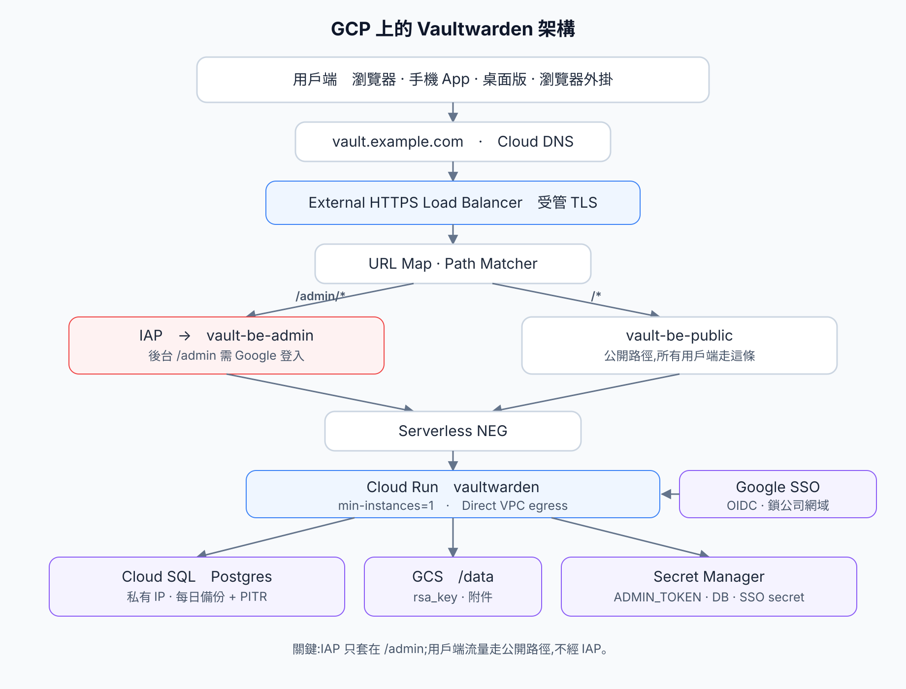
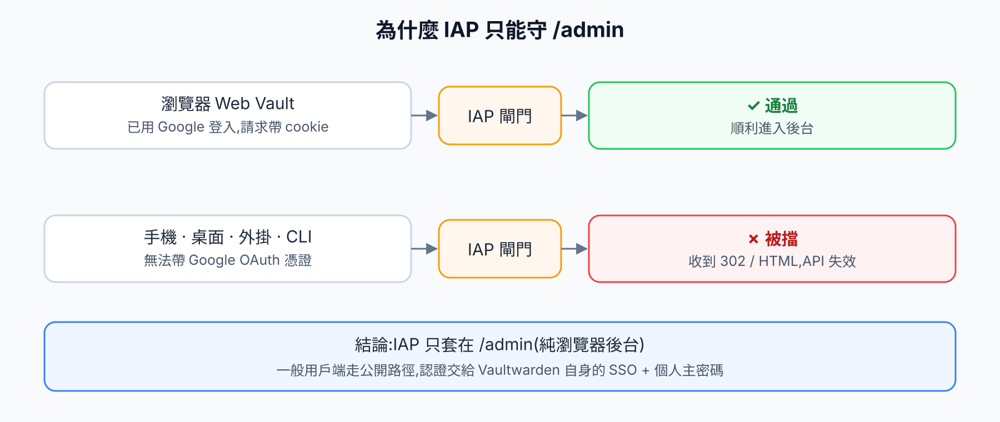
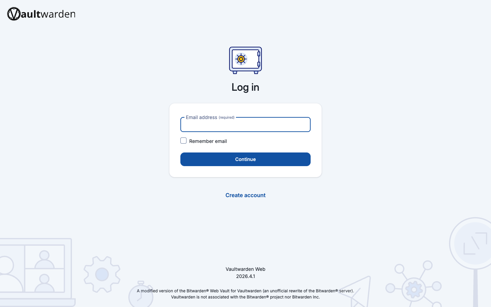
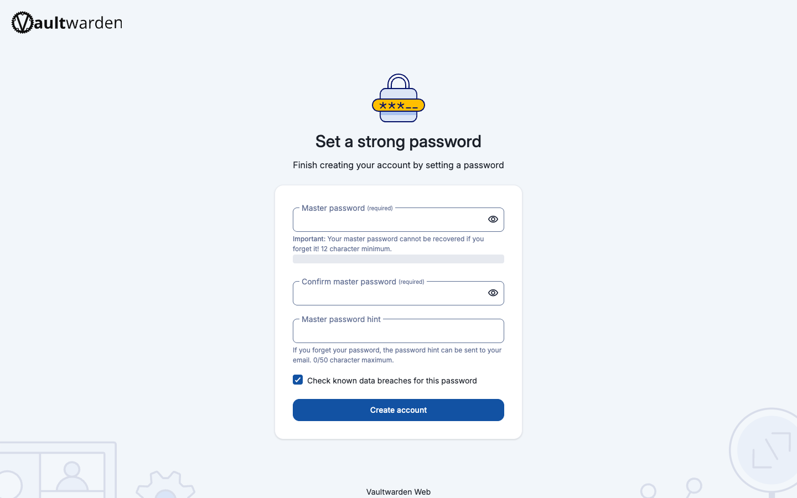
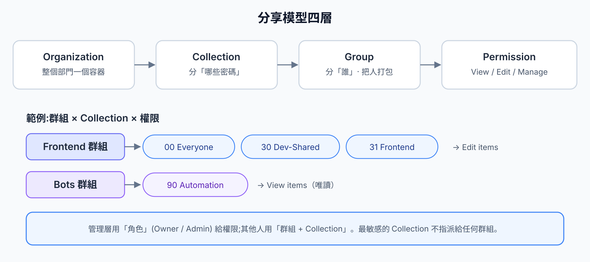
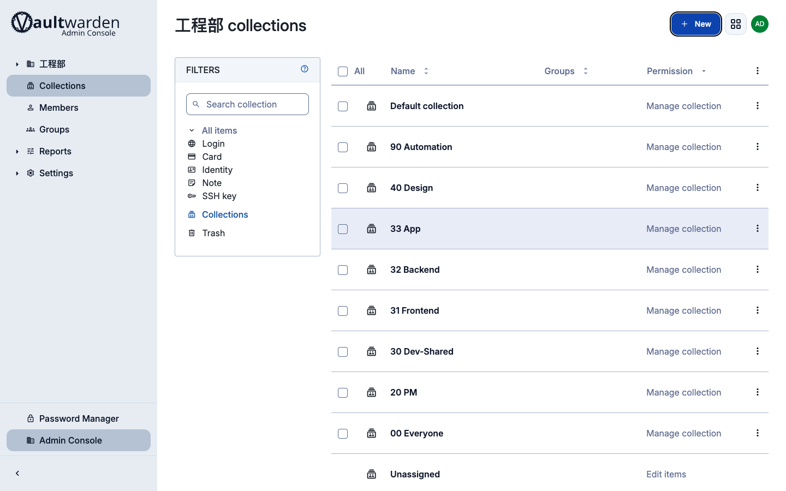
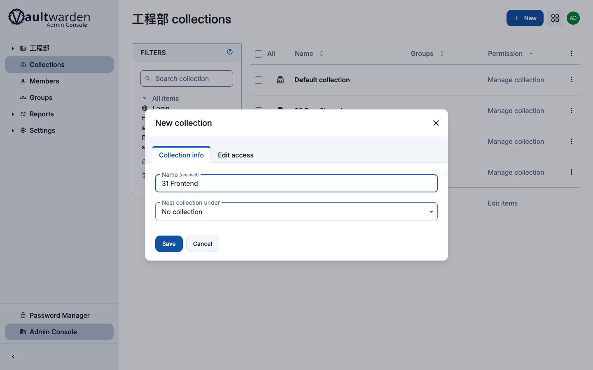
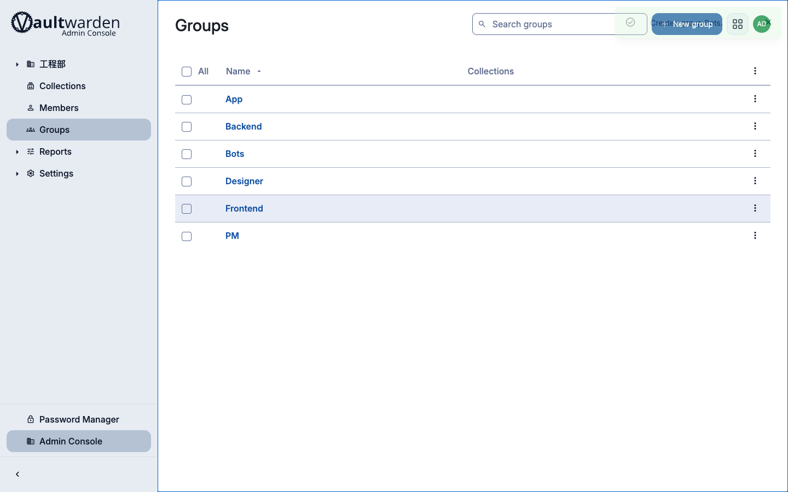
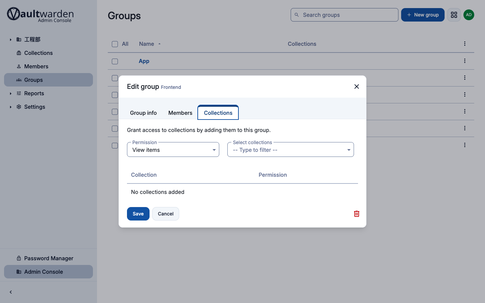
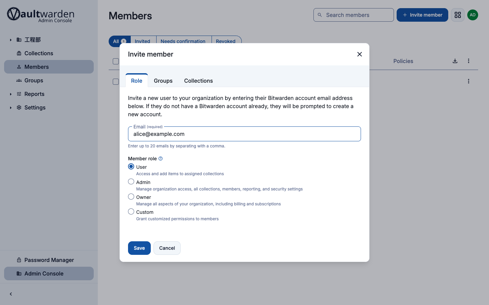

<style>
/* 這篇圖多,讓點開後的 lightbox 放到接近滿視窗(僅影響本文) */
.vp-image-modal-card { max-width: 96vw; }
.vp-image-modal-img { max-height: 92vh; }
</style>

團隊要安全地共享密碼、API key、伺服器憑證,與其塞在共用試算表或聊天室裡,不如架一套密碼管理器。[Vaultwarden](https://github.com/dani-garcia/vaultwarden) 是 Bitwarden 相容的開源伺服器(Rust 重寫),資源吃得少、功能卻幾乎對齊商業版,而且**自管、機密不外流、零授權費**。

這篇文章記錄我把 Vaultwarden 架在 Google Cloud 上的完整過程——從基礎設施、踩到的眉角,到團隊成員怎麼用、管理員怎麼管權限。文中所有網域、email、專案名稱都是 placeholder(`vault.example.com`、`your-gcp-project` 等),請自行替換。

## 為什麼選這個組合

- **Cloud Run**:容器化、按量計費、維運單純,不必顧 VM 更新。
- **Cloud SQL for PostgreSQL**:正式、可備份的資料庫,取代預設 SQLite,適合長期服務。
- **Google Workspace SSO**:團隊本來就有公司 Google 帳號,登入直接沿用;成員離職、停用 Google 帳號後,對 Vaultwarden 的存取權也跟著失效。
- **Identity-Aware Proxy(IAP)**:只用來多守一道後台 `/admin`。

## 架構總覽



請求從 `vault.example.com` 進來,經 External HTTPS Load Balancer(受管 TLS),由 URL Map 的 path matcher 分流:`/admin/*` 走啟用 IAP 的 backend,其餘走公開 backend,兩者都指向同一個 Cloud Run 服務。Cloud Run 經 Direct VPC egress 連到私有 IP 的 Cloud SQL,`/data` 掛載 GCS bucket,機密全放 Secret Manager。

## 架設:在 GCP 一步步立起來

把指令中的 `your-gcp-project`、`vault.example.com`、bucket 名稱換成你自己的即可。

### 1. 啟用 API

```bash
gcloud services enable \
  run.googleapis.com sqladmin.googleapis.com iap.googleapis.com \
  secretmanager.googleapis.com compute.googleapis.com dns.googleapis.com \
  artifactregistry.googleapis.com storage.googleapis.com \
  servicenetworking.googleapis.com vpcaccess.googleapis.com
```

### 2. 專用 Cloud SQL(私有 IP)

建一個專用的 Postgres 實例,只開私有 IP、開啟每日備份與 PITR:

```bash
gcloud sql instances create vaultwarden-db \
  --database-version=POSTGRES_16 \
  --edition=ENTERPRISE --tier=db-g1-small \
  --region=asia-east1 --availability-type=ZONAL \
  --network=projects/your-gcp-project/global/networks/default \
  --no-assign-ip \
  --enable-point-in-time-recovery \
  --backup-start-time=18:00
```


有些 organization 的 Cloud SQL 預設 edition 是 **ENTERPRISE_PLUS**,而 shared-core 的 `db-g1-small` 屬於 ENTERPRISE。不明確加 `--edition=ENTERPRISE` 就會被拒:`Invalid Tier (db-g1-small) for (ENTERPRISE_PLUS) Edition`。


### 3. 儲存與機密

Vaultwarden 會把 `rsa_key`(簽 JWT 用)、附件、Sends 寫到 `/data`。Cloud Run 檔案系統是暫時的,所以掛一個 GCS bucket 上去:

```bash
gcloud storage buckets create gs://your-vault-data \
  --location=asia-east1 \
  --uniform-bucket-level-access --public-access-prevention
```

機密(後台 token、DB 連線字串、SSO secret)放 Secret Manager。後台 `ADMIN_TOKEN` 建議存 argon2 雜湊:

```bash
docker run --rm vaultwarden/server:1.36.0 /vaultwarden hash --preset owasp
```


`rsa_key` 若沒落在持久化儲存,每次容器冷啟動都會重新產生金鑰,結果就是**所有人被登出**。把 `/data` 掛到 GCS、並設定 `min-instances=1`,可以同時解決金鑰持久化與冷啟動延遲。


### 4. 部署 Cloud Run

image 透過 Artifact Registry 的 remote repository 代理 Docker Hub 拉取。部署時掛上 GCS volume、注入 secret、設定 Direct VPC egress 連私有 DB:

```bash
gcloud run deploy vaultwarden \
  --image=asia-east1-docker.pkg.dev/your-gcp-project/dockerhub-remote/vaultwarden/server:1.36.0 \
  --region=asia-east1 \
  --min-instances=1 --no-cpu-throttling \
  --network=default --subnet=serverless-direct --vpc-egress=private-ranges-only \
  --add-volume=name=data,type=cloud-storage,bucket=your-vault-data \
  --add-volume-mount=volume=data,mount-path=/data \
  --set-secrets=DATABASE_URL=vaultwarden-database-url:latest,ADMIN_TOKEN=vaultwarden-admin-token:latest \
  --set-env-vars=ROCKET_PORT=8080,DATA_FOLDER=/data,DOMAIN=https://vault.example.com \
  --allow-unauthenticated
```


公開 backend 與後台 backend 指向同一個服務。如果把服務改成要求驗證,公開網站流量會被擋掉。正確做法是**保留 unauthenticated,改用 ingress 限制**(下面收尾步驟)達成「只能經 LB」,後台保護交給 IAP。


### 5. 對外入口與 TLS

保留全域靜態 IP、建立 Serverless NEG、兩個 backend(公開 + 後台)、URL Map 的 path matcher(`/admin/*` → 後台 backend)、受管 SSL 憑證,再把 `vault.example.com` 的 DNS A 記錄指過去。受管憑證需要 DNS 生效後才會轉成 `ACTIVE`,通常等 15–60 分鐘。

### 6. IAP 只守 /admin

這是整套架構最容易誤解的一點。



IAP 是為「瀏覽器 + Google 身分」設計的。Bitwarden 的**原生用戶端(手機、桌面、瀏覽器外掛、CLI)無法帶 Google OAuth 憑證**,一旦整個服務套上 IAP,這些用戶端只會收到 302 轉址或 HTML,API 直接失效——而這些正是密碼管理器最核心的入口。所以 IAP 只套在純瀏覽器才會用到的 `/admin` 後台,用戶端流量走公開路徑。

```bash
gcloud iap web enable --resource-type=backend-services --service=vault-be-admin
```


在 Cloud Run 前面啟用 IAP 後,若沒先建立 IAP 的服務代理並授權,登入後會看到 `The IAP service account is not provisioned`。補上這兩步:

```bash
gcloud beta services identity create --service=iap.googleapis.com --project=your-gcp-project
gcloud run services add-iam-policy-binding vaultwarden --region=asia-east1 \
  --member="serviceAccount:service-PROJECT_NUMBER@gcp-sa-iap.iam.gserviceaccount.com" \
  --role="roles/run.invoker"
```


### 7. Google Workspace SSO

跟 IAP 相反,**SSO 是應用層認證**,Bitwarden 官方用戶端內建「Enterprise SSO」流程,所以手機、桌面、外掛都能用(只是部分組合有些粗糙邊角,官方 wiki 有註記)。Vaultwarden 自 2025 年起主線即內建 OIDC SSO,設定只靠環境變數:

```bash
SSO_ENABLED=true
SSO_AUTHORITY=https://accounts.google.com
SSO_CLIENT_ID=<OAuth client id>
SSO_CLIENT_SECRET=<secret>
SSO_AUTHORIZE_EXTRA_PARAMS="access_type=offline&prompt=consent&hd=example.com"
SSO_ONLY=false
```

要把登入鎖在公司網域,最乾淨是把 GCP 的 OAuth 同意畫面設成 **Internal**;若同意畫面是共用的、不方便改,就靠 `SIGNUPS_DOMAINS_WHITELIST=example.com`(官方文件指明此白名單會套用於 SSO 註冊)在應用層擋掉非公司網域的帳號。

保留 `SSO_ONLY=false`(不強制只能 SSO),好處有二:一是 SSO 萬一出狀況還有 email/密碼登入當 break-glass,二是**自動化的 bot 帳號得靠密碼 + API key 登入**(後面管理章節會談)。


即使上了 SSO,使用者**仍要記一組自己的主密碼**。SSO 只負責「證明你是誰」,金庫是端對端加密、要靠主密碼派生的金鑰在用戶端解密——伺服器與 Google 都拿不到。Bitwarden 商業版那種「SSO 完全免主密碼」(Key Connector)Vaultwarden 沒有實作。


### 8. 收尾強化

- 關閉公開註冊改邀請制:`SIGNUPS_ALLOWED=false`(搭配網域白名單)。
- 鎖 ingress 只允許 LB:`--ingress=internal-and-cloud-load-balancing`,封掉 `run.app` 直連。
- 要寄邀請信需設 SMTP——注意 **GCP 永久封鎖 port 25**,一定要用 587/465 接一個 relay;Vaultwarden 也只支援 SMTP 寄信(沒有 API 寄信)。
- 組織要用群組功能,需在伺服器端設 `ORG_GROUPS_ENABLED=true`(beta)。

## 使用:團隊成員怎麼上手

服務上線後,成員的體驗其實只有兩個關鍵觀念,先講清楚能省掉大半的疑問。


1. **自架伺服器**:不論瀏覽器外掛、桌面版或手機 App,登入前都要先把伺服器網址設成 `vault.example.com`。這是新人最常卡的地方。
2. **登入 = Google SSO + 主密碼**:用公司 Google 帳號登入後,還要輸入一組自己的主密碼來解開金庫。是兩步,不是純一鍵。


### 網頁登入

開 `https://vault.example.com`,輸入公司 email、按 Continue,接著選 SSO 登入,導向公司 Google 帳號授權。



### 建立主密碼

首次登入後會請你設定主密碼。這把鑰匙負責解密你的金庫,**忘記幾乎無法復原**,務必妥善保管。



### 各用戶端

- **瀏覽器外掛**(Chrome / Edge / Firefox):安裝後先到設定填入自架伺服器網址,再 SSO 登入,就能自動填入。
- **桌面版**:登入前在環境設定填伺服器網址;登入後可在設定開啟生物辨識快速解鎖(macOS 的 Touch ID、Windows 的 Windows Hello)。注意「解鎖」不等於「登入」——生物辨識只是快速解開已登入的金庫,根仍是主密碼。
- **手機 App**:在登入畫面左上切到自架伺服器、填網址,再 SSO 登入,並開啟 Face ID / 指紋與行動裝置自動填入。

## 管理:Collection、Group、權限與邀請

這部分是給 Owner / Admin 的。Bitwarden 的分享是四層模型,理解了設定就清楚。



- **Collection** 是存取控制的單位——把某類密碼放進一個 collection,再決定誰能存取。
- **Group** 把人打包,直接授權「群組 × collection」,成員異動只要改群組。
- **權限**決定每個群組對每個 collection 能做什麼。
- **角色**(Owner / Admin / User):管理層用角色給權限,其他人用群組 + collection。

### 規劃 Collection

依密碼歸屬切 collection,並加一個全員共用的。例如:全員共用的 `00 Everyone`、最敏感的 `10 Admin`、各團隊各一個(如 `31 Frontend`、`32 Backend`)、跨組共用的 `30 Dev-Shared`,以及給自動化帳號的 `90 Automation`。





### 建立 Group 並指派權限

建群組時就能在 Collections 分頁指派它能存取哪些 collection、權限多大。





權限下拉有五級:

| 權限 | 意義 |
|---|---|
| View items, hidden passwords | 唯讀,且密碼不可顯示明文(可自動填入、不可複製) |
| View items | 唯讀,可看密碼 |
| Edit items, hidden passwords | 可增改,密碼不可顯示明文 |
| **Edit items** | 可增改、可看密碼(一般團隊協作用這個) |
| Manage collection | 可增改 + 管理誰能存取 + 刪除 collection(保留給管理層) |


密碼遮蔽是 UI 層的軟限制。為了自動填入,密碼仍會在用戶端解密,懂技術的人可以挖出來。真正的界線是:**不該知道的密碼,就別放進他能存取的 collection**。


最敏感的 `10 Admin`(GCP、網域、帳務等)不指派給任何群組,只留給 Admin / Owner 角色,把爆炸半徑壓到最小。

### 邀請成員

到 Members → Invite member,填 email、選角色(一般成員 User、管理者 Admin),在 Groups 分頁勾選所屬團隊即可。




流程是三段:管理員**邀請** → 成員用 SSO 登入**接受** → 管理員回到 Members 手動**Confirm**。Confirm 是把組織金鑰加密分享給新成員,是 Bitwarden 的安全設計,不會自動完成。成員在被 Confirm 之前看不到共享內容,這是正常的。

另外,部門長期服務建議**設第二位 Owner**,別讓組織命脈綁在單一個人身上。


### 自動化 / Bot 帳號的最小權限

CI、排程、AI agent 這類非人帳號也常需要讀某些 secret。Vaultwarden 沒有「機器帳號」的概念(那是 Bitwarden Secrets Manager,未實作),所以 bot 用一般 User 帳號,透過 Bitwarden CLI(`bw`)的個人 API key + 主密碼登入(這正是前面保留密碼登入的用處)。

隔離做法:開一個專屬 collection(例如 `90 Automation`)、一個唯讀的 `Bots` 群組只綁這個 collection、每支 bot 一個獨立帳號(便於稽核與個別撤銷),絕不給 Admin/Owner。被盜的 bot 憑證最多只能讀到那幾筆,改不了、也碰不到其他組。

## 成本與小結

整套跑起來大約 **每月 USD 50–70**,主要是 Cloud SQL 與 Load Balancer,tier 可依負載調整。

回頭看,這套架構的幾個關鍵取捨:用 **Cloud Run + Cloud SQL** 換維運單純與正式資料庫;用 **SSO** 換集中控管的登入;把 **IAP 限縮在 /admin** 以免破壞原生用戶端;用 **Collection + Group** 把權限做成角色式、長期好維護。對一個十幾到上百人的部門來說,這是一套機密不外流、授權費為零、又能長期運作的密碼共享方案。

## 投影片下載

這篇文章的內容也整理成三份投影片,可直接下載:

- [在 GCP 上自架 Vaultwarden](./slides/deck1-self-hosting-vaultwarden-on-gcp.pdf) — 架設步驟與踩坑眉角
- [團隊密碼管理器 使用指南](./slides/deck2-team-onboarding-guide.pdf) — 新人 onboard 與各用戶端使用
- [組織管理操作手冊](./slides/deck3-admin-owner-manual.pdf) — Collection / Group / 權限與邀請成員
