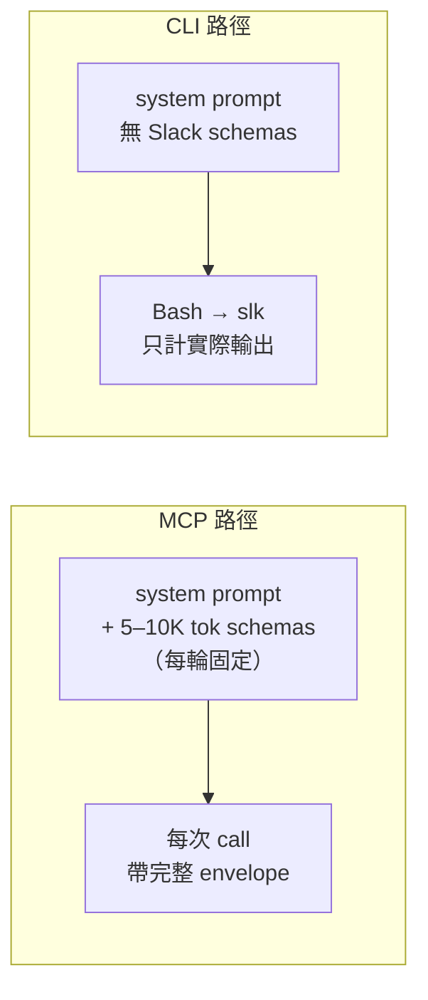
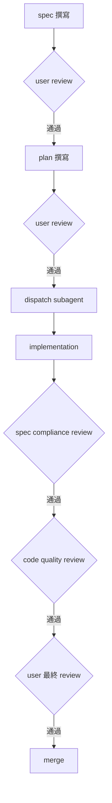
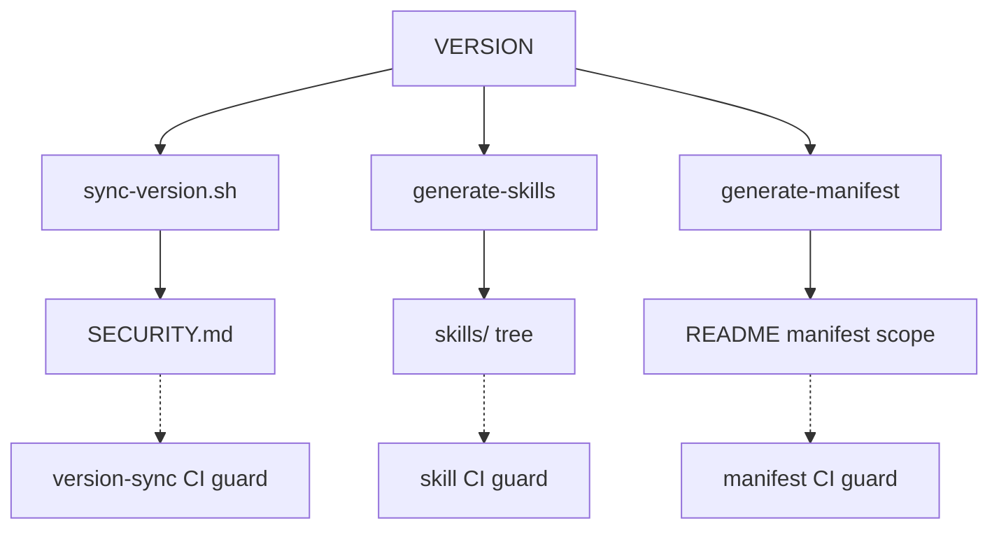
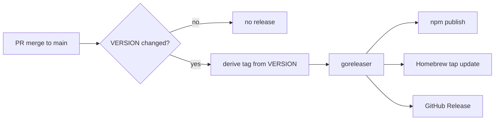

## 1. Slack MCP 在 agent 工作流裡的 token 成本

要讓 AI coding agent 接 Slack 做事情有現成的方案：官方提供 Slack MCP connector，agent 透過它呼叫 `conversations.history`、`chat.postMessage` 等 API。實際接上後，token 成本來自兩個地方。

第一是固定成本。MCP 把所有工具的 schema 載進 system prompt，Slack 連接器約 5K 到 10K token，每一輪對話都會在那裡，不管那一輪有沒有用到 Slack。第二是每次回傳的內容。Slack API 的 response envelope 把所有欄位都帶上：`blocks` 結構、`bot_profile`、`edited`、`client_msg_id`、`team`、attachments 巢狀結構。Agent 在多數場景只需要 user 跟 text，其他欄位讀進 context 之後就丟掉。

把幾個常見動作的 token 量列出來：

| 動作 | MCP | slk | 倍數 |
|---|---|---|---|
| 發訊息 | 200–400 tok `███` | 7 tok `▏` | ~30–60× |
| 讀 3 則訊息 | 1000–2000 tok `██████` | 150 tok `▎` | ~7–13× |
| 搜尋使用者（每人） | 500+ tok `██` | 20 tok `▏` | ~25× |
| 刪除訊息 | 完整 envelope echo `███` | 2 tok `▏` | >100× |
| Tool schema 常駐 | 5–10K tok（每輪固定） | 0 tok | — |

加上 schema 常駐成本，多次往返後 Slack 會是整段對話最大的 context block。

slk 是我為這個落差寫的 CLI。Agent 透過 Bash 呼叫，每次只計算實際輸出的 token，沒有常駐 schema 成本，輸出預設經過裁剪。以下依序處理：取捨、輸出、開發節奏、Slack 文件外的雷區、分發工程、安裝方式。

## 2. 為什麼選 CLI 不選 MCP

MCP 跟 CLI 在 agent 工作流裡計費的位置不一樣。MCP 的 tool 描述跟 input schema 必須一直掛在 system prompt 才能讓 agent 知道工具存在、知道每個參數的型別跟用法，這份描述每一輪都會被計費，跟那一輪有沒有實際用到 Slack 無關。CLI 走的是另一條路：工具的存在感由 `slk --help` 與 agent-facing 的 skill prompt 提供，agent 透過 Bash 呼叫，schema 不需要常駐在 context，只有實際 call 才產生 token。對偶爾才碰 Slack 的對話，這個差距是固定省下；對頻繁用 Slack 的對話，多次往返的累積成本跟 MCP 拉開差距。



形狀的決定權也不同。MCP 為協議完整性最佳化，Slack API 回什麼，connector 大致 forward 什麼出來，欄位齊全、shape 符合 protocol、對接其他 MCP client 一致。CLI 為 agent 可用性最佳化，輸出形狀完全由工具端決定。slk 用 concise 模式做預設，每則訊息只給 `user`、`text`、`ts`、`channel`、`thread` 五欄；需要結構化餵下一個指令時走 jsonl，要給人看時走 table，要原始 envelope 時掛 `--raw`。決定權留在 CLI，不交給 protocol。

slk 的目標範圍是「替掉我自己工作流裡的官方 Slack MCP」，沒有打算成為通用 Slack 接入層或長期的 Slack SDK。範圍收窄帶來的好處是 curated verb 可以針對 agent 場景挑欄位、改預設、寫 trim 邏輯，不用為了通用性保留所有可能的形狀。代價是覆蓋率不會自動跟上 Slack API；為了補這一塊，我留了 `slk api <method>` 這個 escape hatch — 任何 Slack 公開 method 都能直接打、`--params` 帶參數、`--raw` 拿原始 JSON。curated verb 沒做的功能不會卡住使用者，新方法上線也不用等下一次 release。

BYO Slack app 是 slk 的安裝前提。公開 binary 不能塞我自己的 OAuth client secret 進去發佈，所以每個使用者要自己到 api.slack.com 建一個 Slack app，拿到 `client_id`、`client_secret`、以及對應 scope 的 token，再灌進 slk。這也是 slk 開源、選 MIT 的原因：跟既有 agent-slack / slackcli 生態對齊，使用者可以 inspect 整條 token 處理路徑再決定是否信任。代價是 onboarding 不是「下載就能用」，要先完成 Slack app 設定才能進入第一個指令。為了壓低這層摩擦，我把整套設定步驟寫進 README，並提供兩條 token 路徑 — `slk auth login` 直接跑 OAuth flow、`slk auth set-token` 給已經有 token 的使用者直接貼上。

技術選型上選 Go static binary，主要為了三件事。第一是啟動快：agent 在一個任務裡可能連續呼叫 slk 多次（讀完訊息接著回覆、搜完使用者接著開 DM），啟動成本對體感跟總時間都敏感，Go binary 的冷啟動低於 Python/Node CLI 一個量級。第二是沒有 runtime 相依：使用者不需要先裝 Python 或 Node 環境，下載對應平台的 binary 就能跑，agent 在新環境裡呼叫也不用先確認 interpreter 版本。第三是 cross-platform 出 binary 簡單，goreleaser 一次就能出 darwin/linux × amd64/arm64 四份，分發成本低。

| # | 決策 | 一句話原因 |
|---|---|---|
| D1 | 取代官方 Slack MCP | token 成本 + 一致使用單一工具鏈 |
| D2 | Go static binary | 啟動快、無 runtime deps |
| D3 | 開源 MIT | 與既有 agent-slack/slackcli 生態對齊 |
| D4 | BYO Slack app + BYO token | 公開 binary 不能塞 client secret |
| D5 | curated verbs + `slk api` escape hatch | 命令收乾、覆蓋率不落後 Slack API |

## 3. Token-efficient 的輸出長什麼樣

承前一節的前提，slk 預設輸出做裁剪，原始 envelope 要的時候再加 flag 拿回來。這一節說明四種 output format、resolve 層、`--raw` 的分工，以及為什麼用 `--dry-run` 取代 interactive confirm。

### 3.1 四種 output format

slk 提供四種 format，用 `--format` 切換：`concise`（預設）、`json`（trimmed）、`jsonl`（streaming / pagination）、`table`（人類掃讀）。四種都是同一支 read verb 的輸出層，後端共用同一份資料、只是序列化策略不同。同樣一支 `slk msg read` 在不同 format 下的樣子如下。

`concise` — 預設，給 agent 直接讀：

```
$ slk msg read C0123456789 --limit 1
Alice: 線上會議改 2pm OK？ [05-19 14:30]
```

`json` — 也經過裁剪，保留結構化欄位給 agent 解析、不帶 `blocks` / `bot_profile` / `client_msg_id` 這類巢狀雜訊：

```
$ slk msg read C0123456789 --limit 1 --format json
{"user":"Alice","text":"線上會議改 2pm OK？","ts":"1779172200.000100","channel":"C0123456789"}
```

`jsonl` — 一行一物件，給 pagination / streaming 用，agent 可以邊讀邊處理而不必等整個 array 收完：

```
$ slk msg read C0123456789 --limit 3 --format jsonl
{"user":"Alice","text":"先看下 PR","ts":"1779172200.000100","channel":"C0123456789"}
{"user":"Bob","text":"OK 我看","ts":"1779172260.000200","channel":"C0123456789"}
{"user":"Alice","text":"thx","ts":"1779172320.000300","channel":"C0123456789"}
```

`table` — 對齊欄位，人類 review 時看比較舒服：

```
$ slk msg read C0123456789 --limit 2 --format table
USER   TIME           TEXT
Alice  05-19 14:30    先看下 PR
Bob    05-19 14:31    OK 我看
```

對照如下：

| Use case                 | Format    |
|--------------------------|-----------|
| Agent 預設讀取           | `concise` |
| Agent 要結構化欄位處理   | `json`    |
| 大量訊息分頁 / streaming | `jsonl`   |
| 人類在 terminal 掃讀     | `table`   |

### 3.2 resolve 層

Slack API 回傳的 `user` 欄位是 `U0123456789` 這種 ID，`channel` 也是 `C0123456789`。Agent 直接讀 ID 沒問題、人類看就辛苦，而且 agent 後續要把 ID 串成自然語言回覆時也得自己再查一次。slk 預設會把這兩種 ID 換成 user / channel 名稱。

行為三點：

- 第一次查到後快取在 `~/.config/slk/cache/`，後續同一個 ID 不再打 `users.info` / `conversations.info`，省一輪 API call。
- resolve 失敗（permission denied、user 已 deactivate、channel 對 token 不可見等）自動降級回原始 ID，不報錯也不中斷主流程。輸出裡 ID 跟名稱混雜時，agent 仍然拿得到完整列表。
- `--no-resolve` 是退路，需要原始 ID（例如要把結果餵回 `slk api` 再做下一步呼叫）時打開。

resolve 是「能美化就美化、不能也不影響使用」的 best-effort 層，不是 hard dependency。

### 3.3 `--raw` 不是預設

curated verb 的預設輸出已經把 agent 用不到的欄位裁掉。要拿回 trim 掉的整段——例如 `blocks` 結構、`reactions` 陣列、`edited` 子物件——加 `--raw` 即可，slk 會回 Slack 原樣的 JSON envelope。

`slk api <method>` 則相反，預設就是 `--raw`。這個 escape hatch 的設計初衷是「給我 Slack 原樣回傳」，所以 curated 的裁剪規則不套用。需要時可以反過來加 `--format concise` 嘗試套用 slk 的裁剪邏輯，但 `slk api` 涵蓋整個 Slack Web API 表面，並非每個 method 都有 curated 對應，因此預設不裁剪是合理的 default。

這個分工讓 curated 為高頻 case 優化輸出，escape hatch 為長尾 case 保留出路，兩邊預設值各自符合該層的使用場景。換句話說：高頻路徑省 token，長尾路徑保留完整 envelope，agent 不必為了拿一個 edge field 而放棄裁剪過的 default。

### 3.4 `--dry-run` 取代互動式 confirm

所有 write verb——`msg send`、`msg delete`、`channel archive`、`canvas update` 等——都支援 `--dry-run`。加上之後 slk 會印出即將送出的 API call shape 但不真的打 API：

```
$ slk msg send C0123456789 "hello" --dry-run
DRY RUN: would call chat.postMessage channel=C0123456789 text="hello"
```

沒有任何 write verb 在預設情況下會跳 interactive prompt 要 agent 確認。原因是 agent 在 batch flow 跑互動 prompt 會卡住，行為對外不可預測，也讓自動化測試難寫。Agent 想做雙階段確認時自己安排：先 `--dry-run` 印出 shape、自己 review、確定後再去掉 `--dry-run` 跑一次。

唯一的例外是 `slk auth set-token`，預設是 interactive 並用 hidden input 收 token，這個例外只給 human onboarding 場景用。Agent 要在自動化情境下塞 token 時走 stdin 帶值，不會撞到 interactive UI。其他命令路徑都不假設 terminal 是 TTY，CI、subagent、log capture 等場景行為一致。

## 4. 開發節奏

slk 的初版 sprint 把命令功能跟第一版 GoReleaser 釘下來；後續的工程量幾乎全部花在分發、auth、codegen、release flow。這節先講節奏怎麼切，再講為什麼分發比寫功能還費工。

### 4.1 spec → plan → impl 三段節奏

我把每件功能切成三段文件，動手前兩段都先寫過、user review 過。

spec 是「我要做什麼、不做什麼」的書面協議。第 1 節提到的 token-efficient 輸出格式、`--raw` escape hatch、token 存放策略，這些決策都先在 spec 裡定案，落筆前的 brainstorming 主要在這個層級對齊。spec 沒有 code，只有介面契約、scope、不做什麼。

plan 是 phase-by-phase 的步驟：每一階段要動哪些檔案、新增哪些 symbol、跑哪些測試命令、預期輸出。plan 用對話語言（繁體中文）寫，因為它的關鍵讀者是 review 它的我，不是 LLM。

impl 才是真正動手的階段。動手之前 spec 跟 plan 都過了 user review gate，spec 通過才寫 plan，plan 通過才開分支。

把字寫到這個量不是為了把字寫多，是為了讓 plan 能被 subagent 接住——下一節會講為什麼。寫得越具體，subagent 接到時可以直接照著走，不需要回頭問主對話「這個 flag 該叫什麼」、「這個錯誤該回哪個 exit code」。spec 跟 plan 是一次性成本，impl 階段省下來的對話輪數會把它賺回來。

整條節奏的 gate 結構長這樣：



### 4.2 Subagent 分工

每個 implementation phase 都 dispatch 一個 fresh Claude Code subagent，context 隔離。

subagent 拿到的不是整個對話歷史，是 plan 裡那一段 phase 的 scope：要動的檔案清單、要實作的 function 簽章、要新增的測試、預期的 dry-run 輸出。它不知道前面其他 phase 怎麼決策、也不需要知道，照著 plan 走就好。這樣做有兩個好處：主對話的 context 不會被 impl 細節塞爆，subagent 之間的決策也不會互相污染。

subagent 完成後做兩階段 review。第一階段 spec compliance：交出來的 code 是否符合 plan 的 scope、有沒有偷做 plan 沒列的東西、測試是否覆蓋 plan 列的 case。第二階段 code quality：命名、錯誤處理、跟既有 helper 的重複度。兩階段都過了才交給 user 做最終 review，user review 是最後一道 gate。

哪些事不交給 subagent：Slack app 申請流程、token 取得後的真實驗證、release tag 的觸發時機、PR 真正按下 merge、跟 user 體感相關的 UX 取捨（例如 set-token 該不該做 TUI、`--raw` 該放在哪一層）。這些有的是要在瀏覽器裡操作的步驟，有的是需要看實際輸出才能判斷的取捨，subagent 拿不到 context。dispatch 時也明確跟 subagent 講：不要動 commit-helper、不要建 SPEC.md / CLAUDE.md / README.md，避免它順手覆蓋掉 SSOT 文件。

### 4.3 AI-assisted 沒有想像中省力的部分

三段節奏 + subagent 分工聽起來很順，但有幾塊不會因為接了 AI 就變輕鬆。

第一塊是 Slack 官方文件以外的行為。這些 edge case 沒有先驗知識，每一條都是手撞出來、寫進測試、再補到 README 與 SPEC 的；第 5 節會展開五個例子。

第二塊是分發環節。goreleaser 設定、npm publish、Homebrew tap 更新、generated artefact 的同步靠 CI gate 兜，不靠 agent 自己注意；第 6 節會展開 VERSION SSOT 跟三個 guard job 怎麼設。

第三塊是 release flow 也會失敗。一個 transient 401 曾讓某個版本部分上架不全，最後用 fix-forward 跳號處理。

真正省的不是「不用想」，是「想完馬上能變成可執行的草稿，且草稿格式一致」——spec 想完、plan 想完之後，impl 階段不再需要從頭組裝對話。

### 4.4 分發比寫功能還久

初版 sprint 把九個 command groups 全部 scaffold 起來：`api` / `auth` / `canvas` / `channel` / `list` / `msg` / `search` / `thread` / `user`，包含 dry-run、`--raw`、httptest 覆蓋，外加第一版 GoReleaser + Homebrew tap + companion skill 雛形。後續再陸續補上 `bookmark` / `pin` / `dnd` / `file` / `usergroup` / `team` / `emoji`。

剩下的工程量分散在四類：credential 加密、release flow（VERSION SSOT + CI guard + tag 自動化）、skill / scope codegen、auth 重設計。第 6 節展開。

## 5. Slack 文件外的五個邊緣行為

以下五個行為在 Slack 官方文件沒有明確記載；slk 開發過程逐一撞到後寫進 README 與 SPEC 當 known issue。

### Trap 1：5 分鐘內的 scheduled message 假 ok

```
$ slk msg schedule C0123456789 "hi" --post-at 2026-05-22T14:55:00
ok scheduled_message_id=Q0123456789
$ slk msg delete-scheduled Q0123456789
ok
```

但訊息實際仍會送出。原因：Slack 在排程觸發前約 5 分鐘進入「不可取消」窗口，`chat.deleteScheduledMessage` 在這個窗口內仍回 `ok=true`。Slack docs 沒寫；這是從邊緣 issue 與實測拼出來的。

slk 的處理：README + SPEC 寫入 known issue；CLI 本身不擋（擋了會誤殺 5 分鐘外的合法 delete case）。

### Trap 2：self-DM 的 chat.delete 回 internal_error

對自己 DM 自己的訊息呼叫 `chat.delete` 會收到 `internal_error`。唯一可刪 self-DM 的路徑是 Slack UI。slk 在錯誤訊息裡引導改用 UI。

### Trap 3：slackLists.delete 在公開 API 缺席

Slack Lists 的建立 / 讀取 / 加 item / 改 item 都有公開 method，唯獨 delete 沒有。Lists 整體只能透過 UI 清。slk 的 `list` 群組不提供 delete verb，避免假裝有這個能力。

### Trap 4：Slackbot 的 is_bot=false

透過 `users.list` 拿回的 Slackbot（給 reminder / 通知用的內建 bot）回傳 `is_bot=false`。要在 user list 過濾「真人 vs bot」時，需要用 literal `USLACKBOT` 做特判；光看 `is_bot` 會把它分類成人。

### Trap 5：canvas.read 拿到的是 Quip HTML

Slack canvas 在 API 層回傳的是 Quip 的 HTML，不是 markdown 也不是 Slack 自有結構。要給 agent 直接消化的話需要自己做 HTML → markdown 的轉換。slk 內建一個 quip→markdown converter（含 fixture test）處理這層。

把這五項從 README 和 SPEC 都寫進去，後續踩到的人不用花同樣時間重新發現。

## 6. 分發比寫功能還久

「寫完一個 CLI」跟「把它變成別人可以安裝、可以維護、可以發版」中間隔一條很長的工程線。以下五小節是這條線上的五個決定。

### 6.1 VERSION SSOT 加上 CI 三 guard



slk 的版本來源是 repo 根目錄一個 `VERSION` 檔，內容只有一行語意化版號。其他「會出現版號」的地方都從這個檔案派生：

- `scripts/sync-version.sh` 把 `VERSION` fan-out 到 `SECURITY.md` 的支援版本表。
- `go run ./cmd/slk generate-skills` 從 binary 自身的命令樹重建 `skills/` tree — 一個 `slk` 索引加每個 command group 一個 `slk-<group>` skill 檔。
- `go run ./cmd/slk generate-manifest` 從同一份命令樹的 `userScopes` / `botScopes` 註記重建 README 裡的 Slack app manifest scope 區塊。

光有 codegen 還不夠，得有東西在 CI 把它鎖住。`.github/workflows` 裡有三個 guard job：`version-sync` 驗 `SECURITY.md` 與 `VERSION` 一致、`skill` 驗 `skills/` tree 與當前命令樹一致、`manifest` 驗 README 的 scope 區塊與當前命令樹一致。任何一個檔案沒同步就擋 merge，PR 的 status check 會直接紅燈。

這套流程分三段疊起來：先把 codegen 與 release flow 接好，再把 fan-out 範圍擴到 `SECURITY.md` 等周邊檔，最後把原本單檔的 skill 拆成索引加 per-group tree。拆完之後新增一個 command group 不會動到舊的 skill 檔，diff 更乾淨。

### 6.2 VERSION-driven release



有了 SSOT，release trigger 就可以單純綁在那一個檔案上。流程是：PR merge 到 `main` 之後，GitHub Actions 偵測 `VERSION` 這次有沒有變動；若有變動，job 會 derive 出 `v<VERSION>` tag、跑 goreleaser、發 npm 套件、更新 Homebrew tap formula。若 `VERSION` 沒動就什麼都不做，一般的 feature / fix PR 不會誤觸 release。

這裡刻意把 tag 當 artifact、不當 trigger — 我不手動 `git tag v0.x.y`，避免人手打的 tag 跟 `VERSION` 漂移。release 從決定發版到上架沒有人介入的環節，「發版」這件事就是「合一個改了 `VERSION` 的 PR」。

### 6.3 macOS 簽章 — 評估後決定不做

slk 是個會在 macOS 跑的 binary，理論上要簽章 + notarize 才能讓使用者第一次執行不被 Gatekeeper 攔。實際盤點之後決定不做。

Apple Developer Program 年費約 99 美金，對個人 OSS 維護是經常性支出。不簽章時，macOS 對所有從網路下載的 binary 預設會加 quarantine bit，使用者第一次執行需要在系統設定的「隱私權與安全性」批准一次 — 這是 macOS 對任何未簽章 binary 的標準行為，不是 slk 特有的問題，也不會在批准之後重複出現。

評估完寫進 SPEC 的 `## Non-goals` 鎖住：未來不簽章、不 notarize、不為了繞 Gatekeeper 改 release pipeline。寫成 non-goal 而不是「目前沒做」，是為了讓之後翻到這條的人不用重新評估一次。

### 6.4 homebrew-core 暫緩

Homebrew 有兩條路：官方的 homebrew-core、或自己維護一個 tap。slk 走自訂 tap：

```
brew install howar31/tap/slk
```

homebrew-core 的 de facto 收 PR 門檻在 200 顆 star 以上，maintainer 會以此為主要篩選依據。slk 目前的 star 數距離這條線還有相當距離，先留在自訂 tap。SPEC 寫成「等 star 數接近門檻再評估」，不是永久 non-goal — 條件成立時這條會被重新打開。

### 6.5 Auth 介面改過一次

最後一條跟 release engineering 沒關係，但跟「分發」的另一面相關 — 使用者第一次裝完之後第一個碰到的就是 auth 介面。

初版設計：一個 profile 裡可以同時放 user token（`xoxp-`）和 bot token（`xoxb-`），CLI 用 `--as user|bot` 切哪一支生效。設計時的想法是「一個 workspace 一個 profile」對使用者比較直觀。

實際用了一陣子後，碰到的情況是 bot 跟 user 在 Slack 是兩個獨立 identity，scope 集合不一樣、設定流程不一樣、failure mode 也不一樣，硬塞進同一個 profile 反而要在每個 command 都解 `--as`。後來改成一個 profile 一個 token：bot flow 自成一個 profile，scope 從 token 前綴推斷、`auth status` 時用 `auth.test` 做 live verify；命令樹的 `userScopes` / `botScopes` 註記同時驅動 6.1 節提到的 manifest 生成。

改的時機選在 1.0 之前 — 介面定型前砍掉重做的成本比定型後低，沒有對外承諾的相容性要維護。

## 7. 安裝與一個 demo

### 7.1 安裝

兩條路任選：

```bash
brew install howar31/tap/slk      # macOS / Linux
# 或
npm install -g @howar31/slk        # 任何環境
```

兩條路徑都是第 6 節講的 release pipeline 自動產出，版本同步、不會落差。Windows 用戶走 npm 路徑，或從 GitHub Releases 直接下載對應平台的 binary 解壓即用，沒有額外 runtime 依賴。

### 7.2 Claude Code skill 安裝

```bash
npx skills add https://github.com/howar31/slk
```

跑完之後 Claude Code 會自動載入 slk 對應的 skill prompt，agent 不必額外讀 README 也知道怎麼呼叫 `slk msg`、`slk channel`、`slk canvas` 等 verb，以及每個 verb 的 flag 形態。Skill 內容由 `slk generate-skills` 從命令樹直接產生，跟 binary 版本同步，不會發生 prompt 描述與實際 verb 不一致的狀況。

### 7.3 一個 demo

```bash
slk auth login                    # 開瀏覽器跑 OAuth（要先建一個自己的 Slack app）
slk msg read #general --limit 5
slk msg send #general "hello from slk" --dry-run   # 先試水溫
```

第一行會帶到 README 裡的 BYO Slack app 流程：自己在 Slack 後台建一個 app、勾 scope、拿 client ID/secret，slk 接管 OAuth callback，token 加密寫進 `~/.config/slk/config.toml`。第二行直接示範 3.1 節的 concise 輸出。第三行的 `--dry-run` 對應 3.4 節的設計：agent 可以在同一個 turn 裡先 plan、再 execute。

### 7.4 收尾

對需要頻繁與 Slack 互動的 agent workflow，concise 預設輸出加上沒有常駐 schema 成本，加起來就是第 1 節列的那組數字；越是長時間、跨多個 turn 的工作流，差距越明顯。

Repo 在 `github.com/howar31/slk`，架構與設計決策寫在 SPEC.md，verb 全表來自 `slk --help` 與 `skills/` 目錄樹，發佈與簽章策略可參考 SECURITY.md 與第 6 節提到的 release pipeline。遇到 bug、想補 verb，或發現第 5 節之外的 Slack 邊緣行為，都可以在 GitHub issue tracker 開 issue，附上 `slk version` 與重現步驟。

slk 仍在 0.x，命令表面與內部 helper 都還會調整，client 端不建議 pin 過於精細的 behavior，例如某個欄位的排列順序或 concise 輸出的逐字格式；穩定的 contract 是 verb 名稱與 flag 語意，需要機器解析的場景走 `--raw` 拿原始 Slack JSON，或鎖定文件化的結構化欄位。
